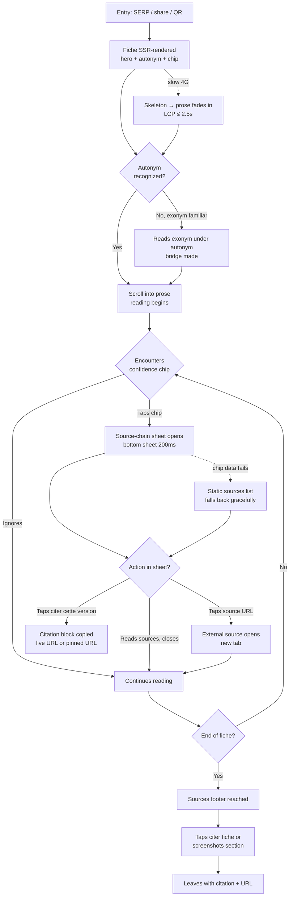
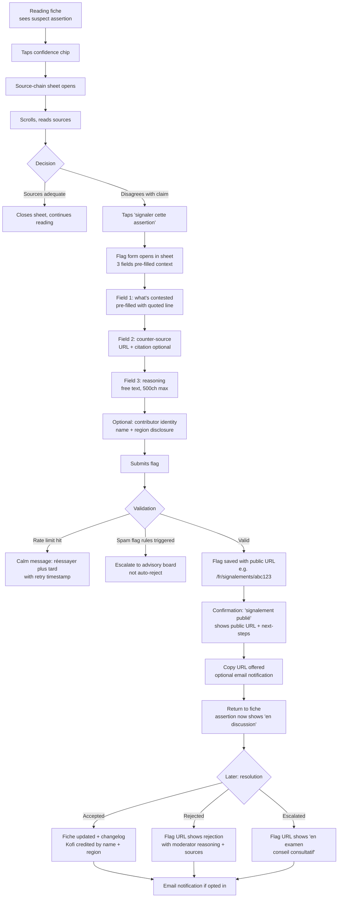
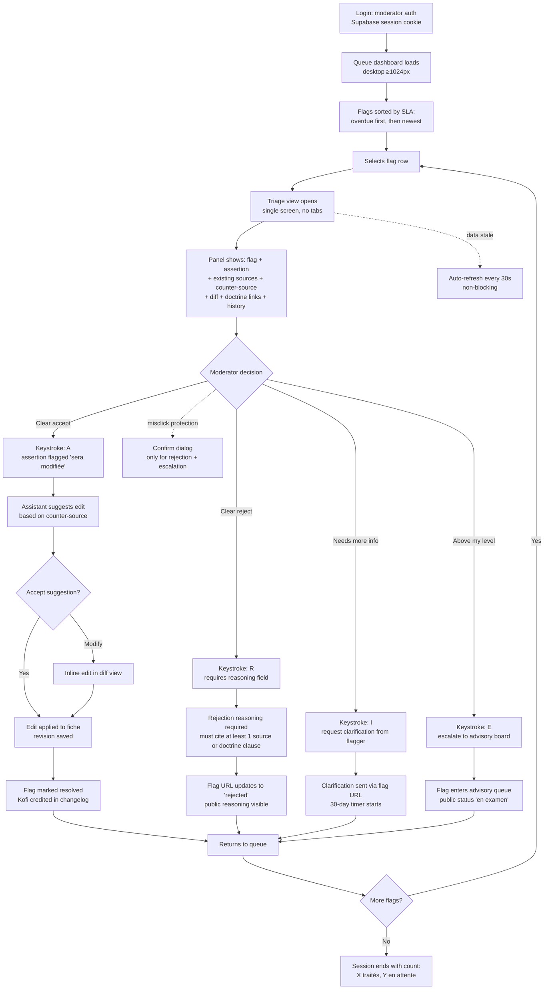
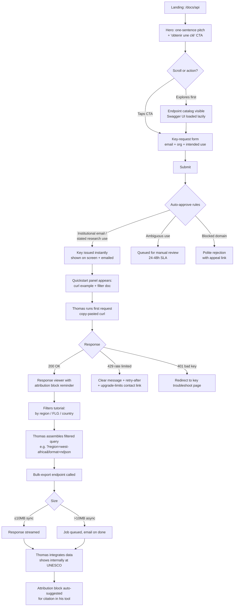
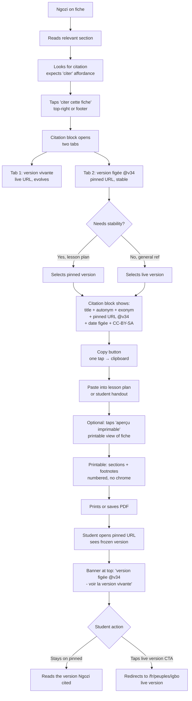

# UX Design Specification — ethniafrica

**Author:** Jnk
**Date:** 2026-04-15

---

<!-- UX design content will be appended sequentially through collaborative workflow steps -->

## Executive Summary

### Project Vision

Africa History (working name, superseding "EthniAfrica" whose root _ethnie_ carries colonial baggage) is a **free, mobile-first, open-data public commons** that retells the history of African peoples from their own point of view — a decolonial counter-encyclopedia to Wikipedia / Britannica. Delivered French-first (multilingual shape preserved but deferred), it is a dual surface product: a reading web app (Next.js 16 SSR + edge cache, breakpoints 430 / 720 / 800 px, "Carte vivante" design system already in production for country pages) plus a public REST API (authoritative OpenAPI 3.1, first-class product surface for open-data reuse, not internal plumbing).

The load-bearing UX thesis is **radical source transparency as a first-class product surface**. Every fiche publishes its confidence score, provenance chain (primary / secondary / tertiary / AI-enriched with resolvable URLs + page + year), last human-verification date, classification status, and per-assertion flag inbox — all above the fold, tappable within 10 seconds of landing. Module #0 (Sources & Verification) is not a settings screen behind a gear icon; it _is_ the reading surface. The wager is that radical disclosure converts structural weakness (solo dev + AI-enriched dataset + decolonial posture) into defensible credibility no competitor currently owns.

### Target Users

Five journey-grounded personas carried from the PRD:

- **Amina, 16, Dakar lycéenne _(primary)_** — homework on her own people, entry-level Android on 4G, rationed data, 9 p.m. shared-bedroom session. Success = autonym visible first, confidence chip tappable, source list screenshot-ready under 2 s TTFB.
- **Kofi, 34, diaspora / Atlanta _(primary)_** — contests an assertion about Akan matrilineal kinship with a counter-source. Success = per-assertion flag UI, public flag URL, visible moderation status, public contributor credit on resolution.
- **Fatou, 31, volunteer moderator / UCAD PhD _(secondary)_** — triages the queue ~4 h / week on desktop ≥ 1024 px. Success = moderator dashboard with SLA counters, assistant-suggested edits, doctrine-clause links on sensitive assertions, advisory-board escalation path.
- **Thomas, 42, NGO data engineer / Nairobi _(secondary)_** — pulls a CC-BY-SA-licensed dataset for a language-revitalization pipeline. Success = hosted Swagger UI, self-serve API key, filters (`minConfidence`, `sinceVerifiedAfter`, `languageFamilyId`, `countryIso3`), attribution block, integrations showcase.
- **Ngozi, 44, Lagos history teacher _(primary edge)_** — builds a reproducible 6-week Yoruba unit. Success = pinned-version URL (`@v34`), revision-history diffs, printable view with numbered source footnotes, "citer une version figée" block.

Audience explicitly _not_ primary: academia, Western casual curious. Read-only audiences are welcome at any age; contribution features are gated at 16 + (EU digital age of consent) to avoid COPPA exposure.

### Key Design Challenges

1. **Surfacing a complex trust fabric without cognitive overload on mobile.** Confidence chip + classification-status banner + autonym-above-exonym + tappable source chain + per-assertion flag affordance must all land in the first 430 × 812 px viewport under a 2 s LCP budget, no horizontal scroll, tap targets ≥ 44 px. The single hardest problem — density vs. legibility vs. performance, three-way.
2. **Per-assertion flagging inside a reading surface.** Tapping one sentence to dispute it without breaking reading flow: long-press on mobile, hover + icon on desktop, inline-on-focus for keyboard / screen-reader — every pattern has tradeoffs the PRD leaves open.
3. **Pinned-version (`@v34`) pedagogical affordance.** Users have no prior mental model for "this page frozen in time". UX must introduce banner + visible diff cue + "back to live" CTA + citation block, without polluting the default reading experience for the 95 % of users who will never use it.
4. **Contested-classification taxonomy surfaced without making every fiche look broken.** `classificationStatus ∈ {consensual, contested, colonial-legacy, reconstructive}` must be visible but not alarmist. Visual language must communicate _contested = healthy scholarly humility_ vs. _broken = avoid_.
5. **Triple-surface coherence on one design system.** Reading UI (French, mobile-first, narrative) · moderation UI (French, desktop-first, dense, SLA-driven) · developer portal (Swagger UI, attribution docs, integrations showcase) — three paradigms sharing tokens, voice, and typography without flattening into uniformity.
6. **Triptych × three access modes (Names / Links / Gazes × Explore / Understand / Play) legible as navigation, not a 3 × 3 grid.** The editorial framework has twelve conceptual cells; the IA must let users arrive through any of them without forcing everyone to understand the matrix.

### Design Opportunities

1. **Confidence chip as a new category primitive.** No current encyclopedic product exposes a machine-readable confidence score above the fold with a full tappable provenance chain. Executed well, it becomes the visual signature of the product and a screenshot-worthy artifact ("look, it tells you how it knows what it knows").
2. **Public flag URL as dignified social contract.** Each flag owning its own shareable URL with visible moderation status turns moderation from back-office into credibility-building theater — if the UX stays dignified (changelog credit, opt-in identity, advisory-board escalation path) rather than voyeuristic (comment-section energy).
3. **Pinned-version banner + diff view as the ArXiv-for-encyclopedia primitive.** No competitor has this. Opportunity to set the citation standard for decolonial educational content and to collapse the usual instability of "citing an encyclopedic fiche" into something teachers can pin with confidence.
4. **Carte vivante design-system extension.** The country page already ships with 8 scrollable sections, tokens in `src/styles/country-tokens.css`, Fraunces + Nunito Sans via `next/font`, 3 breakpoints, and a mature orchestration pattern (`CountryDetailViewV2`). The opportunity is to _extend_ that system into Module #0 primitives (confidence chip, inline flag target, source-chain sheet, revision drawer, pinned-version banner, classification-status indicator) rather than reinvent, and to consolidate the result into a named design system published publicly as part of the decolonial posture.
5. **Mobile-first decolonial reading as a posture.** Most decolonial and African-content sites ship desktop-first with academic verbosity. Shipping a lycéenne-first, 430 px-first reading experience — fast on mid-range Android over 4G — is itself an editorial stance and a strong signal to the target audience.

## Core User Experience

### Defining Experience

The heart of Africa History is a single atom of value: **a user lands on a fiche, reads it, and trusts — or constructively distrusts — what they read, in that order, within 10 seconds.** Every other surface (flag submission, moderation queue, API, pinned versions, doctrine page) is downstream of this one moment. The fiche is the atom; the reading surface is the product.

The core loop is therefore: **arrive → recognize (autonym first) → assess (confidence chip) → read → drill (source chain on demand) → act (cite, flag, share, or leave)**. Each step must be completable on a 430 px viewport in a single-thumb scroll, under a 2 s LCP budget, with no horizontal scroll and 44 px minimum tap targets.

### Platform Strategy

- **Web, MPA with App-Router SSR + client islands** — not SPA, not native. Each fiche URL independently server-rendered and edge-cacheable. No install, no PWA at MVP, no offline.
- **Mobile-first, entry-level Android on 4G is the reference device** — not high-end iPhone. Layout hard-guaranteed at 430 px, minimum screen 320 px. Touch is the default input; keyboard + mouse work but are secondary for the reading surface.
- **Three viewport tiers from the Carte vivante system:** mobile `<` 720 px (primary target, 430 px design width), tablet `md` 720–799 px, desktop `xl` ≥ 800 px (reading-surface max-width cap).
- **Moderation surface is desktop-first** (minimum viewport 1024 px) — denser affordances, SLA counters, assistant-suggested edits. Fatou works on a laptop, not a phone.
- **Developer portal is desktop-first** — Swagger UI, rate-limit tables, attribution blocks, integrations showcase. Mobile works but is not optimized.
- **Performance budget is non-negotiable:** Lighthouse mobile ≥ 85, LCP ≤ 2.5 s on 4G, INP ≤ 200 ms, CLS ≤ 0.1, page weight ≤ 500 KB compressed per fiche, `next/image` mandatory, no render-blocking third-party scripts, analytics `async defer`. These numbers shape every component decision.
- **No real-time, no push at MVP.** Contributor notifications go via transactional email. Revisit only if advisory-board collaboration demands live co-editing.
- **Accessibility WCAG 2.1 AA in CI** via axe-core. French screen-reader testing (NVDA + VoiceOver iOS). Contrast ≥ 4.5:1 body / 3:1 UI / 7:1 source-list sheets. `prefers-reduced-motion` respected; no autoplay.
- **Browser matrix:** Chrome / Edge / Safari / Firefox on desktop (last two stable); Chrome + Samsung Internet on Android; Safari on iOS. No IE11, no legacy Edge.

### Effortless Interactions

- **Recognizing yourself in the first second.** Autonym above exonym, in the dominant type hierarchy. Amina sees "Seereer" before she sees "Sérère" — no click, no scroll, no decoding.
- **Assessing trust without reading documentation.** The confidence chip is self-describing: percentage + source count + last-verified date. The chip alone is informative; tapping it reveals the full chain but tapping is optional.
- **Citing a fiche.** One tap on "citer" produces a copy-ready block (title + canonical URL + last-verified date + CC-BY-SA attribution). Two variants: live URL, pinned-version URL. Works identically on mobile and desktop.
- **Screenshotting a source paragraph for homework.** Sections are laid out so a 320–430 px × ~600 px crop is standalone-legible — includes section title, body text, and numbered source footnotes.
- **Submitting a flag.** Three fields, pre-filled context (the disputed assertion is already identified from where the user tapped). Acknowledge on submit, return a public flag URL. Zero "which entity / which assertion" friction.
- **Going back to the live version from a pinned one.** Banner always visible with a "voir la version vivante" CTA; no escape-room to find it.
- **Copying the canonical URL on any device.** Long-press on the title or a dedicated icon yields a clean, short, shareable URL — never a tracking-param-polluted string.

### Critical Success Moments

- **The <10 s moment (Amina, Journey 1).** If she doesn't see the autonym, confidence chip, and at least one source affordance before her first scroll tick on a 430 px screen, the product fails its thesis. Single highest-stakes pixel real estate in the entire product.
- **The flag-to-public-URL round trip (Kofi, Journey 2).** If Kofi submits a flag and the public URL doesn't appear promptly, or fails to show status + disputed line + contributor credit on resolution, the radical-transparency promise breaks. Credibility test of Module #0.
- **The moderator's queue decision (Fatou, Journey 3).** If the moderator view forces her to reconstruct the dispute from scratch (hunt down sources, open 4 tabs), 4 h/week of volunteer time does not scale. The queue must present flag + disputed-assertion diff + counter-source + existing sources + suggested edit + doctrine-clause links in one view, with a single-keystroke decision path.
- **The pinned-version citation copy (Ngozi, Journey 5).** If the pinned URL isn't discoverable inside 30 s of "I need to cite this", or the printable view loses source footnote numbering, the pedagogical thesis fails. Teachers have a low tolerance for "too clever".
- **The API-to-integration path (Thomas, Journey 4).** If he can't self-serve a key and pull a filtered bulk export in 15 minutes from landing on `/docs/api`, the open-data thesis is theater.

### Experience Principles

1. **Trust is surface, not settings.** Confidence, sources, classification status, and flag affordances live on the reading plane — never hidden behind tabs, accordions, or "advanced" toggles.
2. **Autonym before exonym, always.** Typography and position enforce this at the data-model, component, and layout levels. Endonym primacy is a visual invariant, not an editorial preference.
3. **Reading flow is sacred.** Transparency affordances (flag, source sheet, revision drawer, pinned banner) must never break scroll continuity or reading rhythm. Drawers and sheets over full-page navigations.
4. **Mobile is the canonical layout.** Desktop is a wider mobile, not a different product. No desktop-only affordance on the reading surface; no "mobile-compressed" version of a desktop layout. 430 px is the source of truth; 800 px adds breathing room, not features.
5. **Dignified transparency over voyeuristic openness.** Every public moderation artifact (flag URL, changelog, contributor credit) is framed as scholarship, not comment-section drama. Typography, spacing, and voice carry this weight.
6. **Cite-ready by default.** Every fiche, live or pinned, offers a citation block, a stable URL, and a printable collapse. The product is built for being quoted, not for being bookmarked.
7. **Contested is healthy, not broken.** The classification-status taxonomy is visualized as scholarly humility — a calm, deliberate visual language of honest uncertainty, not a red alert.
8. **Performance is part of the posture.** Shipping fast on mid-range Android over 4G _is_ the decolonial stance in practice. Every component gets an LCP / weight budget and a mobile screenshot in Storybook.

## Desired Emotional Response

### Primary Emotional Goals

**Dignified recognition** is the single emotional north-star. The dominant feeling for the primary audience (Amina, the African diaspora, teachers, lycéens) must be: _"this site sees me, and it takes my people seriously — as a living subject, not a colonial specimen."_ Not awe, not entertainment, not efficiency — those are secondary. The atom of emotion is the first-person-singular moment when the autonym appears and the reader recognizes it as their own. Everything else serves or interrupts that moment.

### Secondary Feelings (by persona)

| Persona                          | Felt state (during action)                  | Felt state (post-action)                                                                                      |
| -------------------------------- | ------------------------------------------- | ------------------------------------------------------------------------------------------------------------- |
| **Amina** (reading for homework) | Recognized · grounded · unhurried           | Equipped (her presentation is better than her classmates') · proud (a site she wants to show her grandmother) |
| **Kofi** (flagging)              | Heard · taken seriously · not-a-troll       | Credited · part of something · invited back                                                                   |
| **Fatou** (moderating)           | Respected · competent · not-a-janitor       | Useful · legitimate ("moderated for Africa History" on her CV without shame)                                  |
| **Thomas** (API)                 | Clear · trusted · not-gated                 | Productive · able to evangelize internally without caveats                                                    |
| **Ngozi** (teaching)             | Safe · reproducible · pedagogically serious | Cited and reused · part of a credible pedagogical network                                                     |

### Emotions to Avoid (actively designed against)

- **Shame / othering.** No "look at these exotic peoples" voyeuristic framing; no museum-vitrine feel.
- **Anxiety / alarm.** The classification-status taxonomy and confidence chip must not feel like virus-warning banners. Contested ≠ broken.
- **Friction fatigue.** Every tap that doesn't serve recognition, trust, or reading is suspect. No cookie walls, paywalls, signup walls, interstitials, or newsletter popups on the reading surface.
- **Performative wokeness.** No aesthetic of "we're-the-decolonial-site-now". Tone stays sober, evidence-based, matter-of-fact. Decolonial posture is _demonstrated_ (autonym-first, public flags, visible sources), not _announced_ (banners, manifestos, mission-statement homepages).
- **AI-slop distrust.** Generic stock imagery, hallucination-flavored prose, missing citations — users recognize AI vibe instantly. Every page must feel human-authored even when AI-enriched, through voice, specificity, and visible provenance.
- **Academic intimidation.** No assumed prior knowledge; no untranslated Latin; no unexplained jargon. A 16-year-old lycéenne is the default reader, not a post-doc.
- **Comment-section voyeurism.** Public moderation must feel like open scholarship, not a subreddit.

### Emotional Journey Mapping

| Stage                                         | Intended feeling                                           | Risk if we fail                           |
| --------------------------------------------- | ---------------------------------------------------------- | ----------------------------------------- |
| **Discovery** (SERP, share link)              | Curiosity, "this looks different"                          | Another-Wikipedia feel, scrolled past     |
| **First fiche landing**                       | Recognition — "they know my people's name"                 | Othered, "this is about them, not me"     |
| **First 10 seconds**                          | Trust + calm — confidence chip understood without a legend | Overwhelm, dashboard anxiety              |
| **Reading body**                              | Grounded, unhurried, invited                               | Scanning fatigue, paywall fear            |
| **Drilling into sources**                     | Rewarded — "look at this level of honesty"                 | Dead links, frustration, broken promise   |
| **Flagging an assertion**                     | Heard, not-a-troll                                         | Ignored, form-into-void                   |
| **Receiving a flag resolution**               | Credited, part of the project                              | Ghosted, bureaucratic                     |
| **Sharing / citing**                          | Confident — "I can stand behind this source"               | Hedged apology ("I know, Wikipedia-ish…") |
| **Returning**                                 | Noticed change — "this fiche has evolved since I read it"  | Static, finished, dead archive            |
| **Error state** (slow net, broken link, down) | Forgiven, still readable, text-first                       | Blank page, broken trust                  |

### Micro-Emotions

| Desired                  | Opposite to prevent | UX lever                                                                                                           |
| ------------------------ | ------------------- | ------------------------------------------------------------------------------------------------------------------ |
| **Trust**                | Skepticism          | Visible confidence score + resolvable sources + public moderation                                                  |
| **Confidence**           | Confusion           | Autonym-first hierarchy, Fraunces + Nunito Sans, generous line-height                                              |
| **Calm**                 | Anxiety             | Muted palette, no red alerts, deliberate whitespace, no popups                                                     |
| **Belonging**            | Othering            | First-person-inclusive voice, endonyms, community self-representation signals                                      |
| **Accomplishment**       | Frustration         | Single-tap citation block, screenshot-ready sections, working footnotes                                            |
| **Delight**              | Boredom             | Occasional well-crafted details (map hover facts, etymology sidebars, type hierarchy) — never gratuitous animation |
| **Humility** (scholarly) | Alarm               | Classification-status visualized in calm / neutral hues, not warning hues                                          |

### Design Implications

- **Dignified recognition** → Autonym in dominant display type; exonym in secondary, smaller type. Photography (when used) depicts living people, not museum artifacts. First-person-inclusive voice in editorial copy where editorially honest.
- **Calm trust** → Muted, earthen palette (warm off-whites, inks, ochres — extends Carte vivante tokens). Red reserved for actual errors (404, broken source, form invalid), never for classification status. Confidence chip uses a measured scale, not a gauge or gamified meter.
- **Heard-ness** → Flag submission pre-fills context; confirms immediately; returns a public URL the user can see. Changelog entry with contributor name + optional regional origin on resolution. No corporate "your feedback has been received" void-language.
- **Calm learning** → Reading rhythm: ≥ 1.6 line-height on body, 65–75 ch line length, deliberate section separation. No sidebars fighting the main column on mobile. Images lazy-loaded, never load-blocking.
- **Forgiven degradation** → Text-first first paint; source list works without JavaScript; fiche legible on failed font load; graceful offline/error screens with calm retry and cached-version link.
- **No performative wokeness** → Editorial voice: direct, concrete, grounded in specifics. No "we stand with…" homepage copy. The decolonial commitment shows in _who_ is named and _how_, not in declarations.

### Emotional Design Principles

1. **Recognition before information.** The first emotion is not "I learned a fact" but "I am seen." Every fiche's above-the-fold zone serves recognition over completeness.
2. **Calm over confidence theater.** Uncertainty is never hidden behind confident design. Neither is it alarmed. The visual language of humility is steady, not anxious.
3. **Invite, don't impose.** Contribution (flag, cite, share, print) is always _offered_, never required, never interstitialized. Reading is free of nags.
4. **The tone is a librarian, not a marketer.** Helpful, precise, unhurried, non-evangelical. Never "Welcome to Africa History 🎉", never "Discover the hidden truths of Africa!"
5. **Contributor credit is dignified.** Full attribution lines, optional region disclosure, no avatar pile-ups, no leaderboards, no engagement counters. The reward is being named in scholarship, not gamified.
6. **Decolonial posture is demonstrated, not announced.** Autonym-first, source-first, classification-status visible — these prove the stance. Banners, manifestos, and mission-statement homepages are forbidden.
7. **Failure is graceful, not apologetic.** Slow network, broken link, missing source — the fiche degrades to text + citation with a calm retry path. Never a blank white page.
8. **Returning users feel growth.** Subtle freshness signals ("updated since you last visited", new flags resolved) without demanding attention or requiring an account.

## UX Pattern Analysis & Inspiration

### Inspiring Products Analysis

References were selected along three axes that matter for Africa History: (a) scholarly-encyclopedic reading surface, (b) public transparency and moderation, (c) mobile-first francophone reading. Plus the product's own Carte vivante system, which is a non-negotiable internal foundation.

**Reading surface & knowledge presentation**

- **Wikipedia (fr / mobile)** — the default mental model the target audience already carries. Adopt: stable canonical URLs, revision-history concept, references footer, language-family cross-links, infobox pattern (distilled, not cloned). Reject: exonym-first editorial grammar, invisible confidence, buried moderation, scanning-fatigue infobox density, desktop-authored feel.
- **Are.na** — library-toned surface around collections of artifacts. Adopt: generous whitespace, restrained typography, "this is serious, not flashy" voice, cross-item linking as calm discovery rather than social gamification.
- **Stripe Docs / Stripe.press** — dense technical content that feels inviting rather than intimidating. Adopt: evidence-and-prose integration, sidebar → bottom-drawer collapse on mobile, mobile/desktop parity of information (not a dumbed-down mobile).
- **The Marginalia search engine** — text-first, fast, no SEO spam, calm result layout. Adopt: performance-first ethos as posture, handmade voice.

**Transparency, moderation & provenance**

- **Our World in Data** — the closest single reference for Module #0. Every chart shows source, update date, methodology link, downloadable raw data, CC-BY licensing on everything. Adopt directly: source-on-surface placement, "last updated" and methodology-link position, download-the-data affordance.
- **Full Fact / Africa Check** — per-claim verdicts with visible badge + evidence chain. Adopt: claim as the unit of flagging; public verdict reasoning. Diverge from: fact-check sites are atomic artifacts, Africa History is narrative — verdicts must never interrupt reading flow.
- **Wikipedia's revision-history + contributions pages (concept)** — per-page changelog with actor, timestamp, diff. Adopt: public accountability trail. Improve: surface it as a reader affordance (drawer, pinned URLs), not only a janitor's tool.
- **ClaimReview (Schema.org)** — structured-data pattern. Adopt: embed `ClaimReview` (or Schema.org extension) so per-assertion moderation surfaces in Google rich snippets and propagates transparency beyond the domain.
- **Zenodo / arXiv** — DOI-minted, version-pinned academic artifacts with `v1 / v2 / v3` URLs and "latest" banners. Adopt directly: **the pinned-version URL primitive** (`@v34` semantics) — arXiv is the canonical pattern for Ngozi's journey.

**Mobile-first francophone reading & African cultural content**

- **Le Monde Afrique (mobile)** — serious francophone reading, 430 px first, long-form with in-line citations and pull-quotes. Adopt: typography rhythm, line-length discipline, reading-progress orientation, mobile primary-nav pattern.
- **RFI Afrique / Jeune Afrique** — mobile-first editorial for francophone-African audiences. Adopt: tone calibration, mobile read-first layout; hold audio affordances for future.
- **Google Arts & Culture** — beautifully-crafted mobile surfaces for cultural content, zoom-into-artifact, storytelling modules, strong photography. Adopt selectively: storytelling patterns for future Module #4 (Names Atlas) and #8 (Colonization & Resistances). Reject: occasional museum-vitrine / colonial framing in their own collection.

**Component / design system references**

- **shadcn/ui** — canonical primitive set per `project-context.md`. Continue: Radix-based composition, headless + styled split.
- **Vercel design system / Geist** — reference for typographic discipline and monochrome restraint. Adopt: typographic scale methodology, token naming, dark-mode-first-class treatment.
- **Carte vivante (internal, already shipped for country pages)** — foundational constraint. Fraunces + Nunito Sans, `country-tokens.css`, 8-section scrollable pattern, 430 / 720 / 800 px breakpoints. Every new surface extends this system — Module #1 (people), Module #2 (language family) and Module #0 primitives live inside it.

### Transferable UX Patterns

| Pattern                                       | Source                    | Africa History application                                                                        |
| --------------------------------------------- | ------------------------- | ------------------------------------------------------------------------------------------------- |
| Source-on-surface + methodology link          | Our World in Data         | Confidence chip + sources sheet above the fold on every fiche                                     |
| Pinned-version URL with "latest" banner       | arXiv, Zenodo             | `@v34` pinned-fiche URL + "voir la version vivante" banner (Journey 5)                            |
| Per-claim verdict badge                       | Full Fact, Africa Check   | Per-assertion `classificationStatus` badge + tappable flag                                        |
| Revision drawer as reader affordance          | Wikipedia (reframed)      | Drawer over full-page; revision log + diff accessible without leaving reading flow                |
| Librarian tone + generous whitespace          | Are.na, Stripe.press      | Copy voice + spacing tokens, not marketing-punch                                                  |
| Claim-granular sharing                        | Full Fact                 | Share link with anchor to specific assertion; OG preview shows the claim + confidence             |
| Downloadable raw data per fiche               | Our World in Data         | JSON / CSV export per fiche, license-tagged, attribution-block included                           |
| Mobile-first long-form reading rhythm         | Le Monde Afrique          | 65–75 ch line length, 1.6 line-height, section dividers, no split columns on mobile               |
| Sidebar → bottom-sheet on mobile              | Stripe Docs               | Navigation and references collapse to bottom sheet on mobile; same information, different density |
| Immutable artifact with version banner        | arXiv                     | Pinned-version as first-class citation primitive                                                  |
| ClaimReview structured data                   | Schema.org / Google       | Per-assertion moderation surfaces in SERP rich snippets                                           |
| Token-first design system with mobile stories | shadcn/ui + Carte vivante | Every new Module #0 primitive ships a Storybook story at 430 / 720 / 800 px                       |

### Anti-Patterns to Avoid

| Anti-pattern                                                                                      | Common source                                 | Why it breaks Africa History                                                                        |
| ------------------------------------------------------------------------------------------------- | --------------------------------------------- | --------------------------------------------------------------------------------------------------- |
| Gamified contribution counters (upvotes, karma, badges, streaks)                                  | Reddit, Stack Overflow                        | Conflicts with "dignified transparency" — turns scholarship into engagement farming                 |
| Confidence-as-gauge (speedometer, thermometer, emoji)                                             | Fitness apps, traffic-light fact-check sites  | Reads as alarm, not humility; conflicts with "contested is healthy"                                 |
| Celebratory onboarding (confetti, "🎉 Welcome!", mandatory tours)                                 | SaaS defaults                                 | Conflicts with librarian tone; forces friction before reading                                       |
| Cookie-consent interstitial, newsletter popup, "rate us" modal                                    | Ad-tech web                                   | Breaks principle #3 (invite, don't impose) and the <10 s moment                                     |
| Infinite scroll with algorithmic re-ranking                                                       | Social feeds                                  | Reading surface must be stable, citable, canonical — not feed-shaped                                |
| Dark patterns on API-key signup (hidden pricing, forced CC, consent traps)                        | SaaS developer portals                        | Open-data thesis requires dignified, plain free-tier access                                         |
| Skeuomorphic "authentic African" aesthetic (mudcloth patterns, "tribal" fonts, savanna gradients) | Well-intentioned but reductive cultural sites | Voyeuristic, essentialist; reproduces the grammar Africa History inverts                            |
| Academic-jargon paywalls of voice (unexplained "autochthonous", "ethnogenesis", etc.)             | Academic publishing                           | Academic intimidation — 16-year-old is the default reader                                           |
| Massive hero banners with stock photos of "Africa"                                                | NGO / heritage websites                       | Performative, flattening, not grounded in specific peoples                                          |
| Comments / discussion threads on fiches                                                           | Wikipedia talk pages, news comments           | Turns moderation into subreddit energy; flagging is the dignified channel                           |
| "AI-enriched" hidden as a vibe (no label, no doctrine, no provenance)                             | Post-2023 AI-slop sites                       | Breaks the radical-transparency promise; Africa History labels AI-enriched explicitly               |
| Desktop-first nav with hamburger-only mobile                                                      | Legacy publishing sites                       | Violates principle #4; mobile must be canonical, not a compressed desktop                           |
| Full-page language / region picker interstitials                                                  | Legacy multinational sites                    | Friction fatigue; French-only at MVP makes this moot, must stay so at reopening                     |
| Dense infobox crammed with every metadata                                                         | Wikipedia desktop                             | Scanning fatigue on mobile; Africa History surfaces only the few signals that matter above the fold |

### Design Inspiration Strategy

**Adopt (high-fidelity reuse):**

- Our World in Data's source-on-surface pattern → direct model for the confidence chip + source drawer.
- arXiv's version-pinned URL primitive → direct model for `@v34` semantics.
- Carte vivante (internal) → non-negotiable foundation for every new module.
- shadcn/ui primitives → non-negotiable component base.
- Stripe Docs mobile-drawer navigation → model for Module #1 people-page sidebar → bottom-sheet collapse.

**Adapt (pattern, not form):**

- Wikipedia's revision-history concept → reframed as a reader affordance (drawer), not an editor's janitor tool.
- Full Fact / Africa Check verdict badges → adapted to `classificationStatus` banner, calmer visual language.
- Le Monde Afrique typographic rhythm → adapted to Fraunces + Nunito Sans pair already chosen, mobile-first defaults.
- Are.na tone & whitespace → adapted to a francophone, scholarly register (closer to librarian than curator).
- Google Arts & Culture storytelling modules → adapted, excluding any colonial-museum framing, for future Module #4 (Names Atlas) and #8 (Colonization & Resistances).

**Avoid (anti-pattern discipline):**

- No gamification, no engagement metrics, no comment threads, no celebratory onboarding, no skeuomorphic "African" aesthetics, no dark-pattern signup flows, no cookie or newsletter interstitials, no hero-with-stock-photo homepage, no infinite scroll on reading surfaces.

**Invent (novel to Africa History, no direct reference):**

- The full provenance chain as a mobile drawer on the reading surface.
- The calm classification-status taxonomy (consensual / contested / colonial-legacy / reconstructive) as a new visual language — not red/yellow/green.
- The public flag URL as a dignified scholarship artifact (not comment-section voyeurism).

## Design System Foundation

### Design System Choice

Africa History adopts a **three-layer themeable design system**, formalized and expanded from the existing Carte vivante shipment:

| Layer                      | Tech                                                                           | Role                                                                                         |
| -------------------------- | ------------------------------------------------------------------------------ | -------------------------------------------------------------------------------------------- |
| **L1 — Primitives**        | shadcn/ui + Radix + Tailwind CSS 3.4                                           | Unstyled, accessible, headless behavior                                                      |
| **L2 — Tokens & Theme**    | CSS custom properties in `src/styles/tokens/*.css` + Tailwind theme extensions | Brand voice made machine-readable (color, type, spacing, elevation, motion, radius, density) |
| **L3 — Domain components** | React components composed from L1 + L2                                         | Africa-History-specific primitives that exist in no external library                         |

The umbrella system is **renamed product-wide** (working name: _Africa History Design System_, pending final product naming). **Carte vivante remains as the country-page layout pattern inside the system**, not the system itself.

### Rationale for Selection

- **L1 is locked in by project rule** — `project-context.md` mandates shadcn/ui as canonical. Replacing it would break scope discipline and require migration the solo-dev budget does not have.
- **L2 is partially shipped** — `src/styles/country-tokens.css` is a working beachhead that needs widening from country-page-specific to product-wide (color scale, type roles including `--ah-type-autonym` / `--ah-type-exonym`, spacing, elevation, motion, radii, density variants).
- **L3 is the real design-system deliverable** — the domain primitives (`ConfidenceChip`, `ClassificationBadge`, `SourceChainSheet`, `PinnedVersionBanner`, etc.) do not exist in any external library. They are the product's visual signature and the locus of decolonial posture as UI.
- **Themeable matches solo-dev + 1-2 collaborator resourcing** — a fully custom-from-scratch system costs weeks no one has; pure Material / Ant reads as generic SaaS; themeable is the exact middle, with a proven production beachhead.
- **One token set + three density profiles** solves the triple-surface coherence challenge (reading / moderation / developer) without fragmenting into three separate systems.

### Implementation Approach

1. **Rename and formalize.** Create `src/styles/tokens/` split by concern: `color.css`, `type.css`, `space.css`, `elevation.css`, `motion.css`, `radius.css`. `country-tokens.css` becomes the country-page layout pattern's token overrides, not the root.
2. **Widen L2 token scope** — semantic color tokens (`--ah-confidence-low/med/high`, `--ah-contested`, `--ah-colonial-legacy`, `--ah-reconstructive`, `--ah-verified`, `--ah-ai-enriched`, `--ah-danger` reserved strictly for actual errors); type roles (`--ah-type-autonym` largest display tier, `--ah-type-exonym` secondary display, body / caption / footnote / source); 4 px base spacing scale (0 / 0.5 / 1 / 2 / 3 / 4 / 6 / 8 / 12 / 16); quiet elevation scale 0–4; reduced-motion-aware motion scale; radii (2 / 4 / 8 / 12 / full); breakpoints 430 / 720 / 800 px confirmed; **density tokens** (`--ah-density-reading` generous / `--ah-density-moderation` dense / `--ah-density-developer` technical) applied at surface root.
3. **Publish the system self-documentation** in Storybook under `src/stories/design-system/*.mdx` (Color / Type / Spacing / Elevation / Motion / Radii pages). Make the system publicly inspectable as part of the radical-transparency posture.
4. **Build L3 domain components in MVP-driven order**, each with Storybook stories at 430 / 720 / 800 px, each with axe-core verification:
   - **Phase 1 — Module #0 reading-surface primitives:** `AutonymExonymHeading`, `ConfidenceChip`, `ClassificationBadge`, `SourceChainSheet`, `FlagTarget` (inline), `FlagForm`, `FlagPublicStatus`, `CitationBlock`, `RevisionDrawer`, `PinnedVersionBanner`, `DoctrineLinkCard`.
   - **Phase 2 — Module #1 People page:** `PeopleDetailViewV2` orchestrator + section components following the Carte vivante 8-section scrollable pattern, adapted for peoples. Integrates all Phase 1 primitives.
   - **Phase 3 — Moderation dashboard (desktop-first, dense):** `ModeratorQueueRow`, `ModeratorDecisionPanel`, `FlagDiffView`, `EscalationPicker` (can slip to Growth if budget tight).
   - **Phase 4 — Developer portal:** `AttributionBlock`, `ApiFilterChip`, `RateLimitTable`, `IntegrationsShowcaseCard` (last two Growth-leaning).
5. **CI gates enforce the system** — every new UI surface ships a Storybook story at the three breakpoints (NFR37); axe-core runs on representative stories; no domain component ships without a story; a stylelint rule (once ESLint config is restored) forbids raw hex / spacing px / font-size in components.
6. **Publish the design system publicly** at `/design-system` or as a deployed Storybook — part of the decolonial posture (contributors can inspect and propose PRs).

### Customization Strategy

- **Wrap shadcn/ui; don't fork.** When a domain primitive needs non-default behavior, compose (`<Sheet><SourceChain /></Sheet>`) rather than duplicate the primitive.
- **Never bypass tokens.** Hex values, spacing px, or raw font-sizes inside components are bugs, enforced by stylelint once root tooling is restored.
- **Dark mode is deferred to Growth but designed for from day one.** All tokens are semantic (not raw colors), so flipping a root class yields a usable dark theme without refactoring. No dark theme shipped at MVP.
- **Motion stays minimal.** Crossfades and sheet slides only on the reading surface; slightly more affordance-animation allowed on moderation and developer surfaces. `prefers-reduced-motion` respected everywhere.
- **Contribution model:** internal-only at MVP; accept external PRs on the system from Growth onward (1-2 collaborators already envisioned in the brief), with a CONTRIBUTING.md scoped to the design system.

### L3 Custom-Components Inventory (MVP scope)

| Primitive                  | Audience             | MVP required         |
| -------------------------- | -------------------- | -------------------- |
| `AutonymExonymHeading`     | Reader               | ✅                   |
| `ConfidenceChip`           | Reader               | ✅                   |
| `ClassificationBadge`      | Reader               | ✅                   |
| `SourceChainSheet`         | Reader               | ✅                   |
| `FlagTarget` (inline)      | Reader               | ✅                   |
| `FlagForm`                 | Contributor          | ✅                   |
| `FlagPublicStatus`         | Public               | ✅                   |
| `CitationBlock`            | Reader / educator    | ✅                   |
| `RevisionDrawer`           | Reader / educator    | ✅                   |
| `PinnedVersionBanner`      | Reader / educator    | ✅                   |
| `DoctrineLinkCard`         | Reader / contributor | ✅                   |
| `PeopleDetailSection` (×N) | Reader               | ✅                   |
| `ModeratorQueueRow`        | Moderator            | ✅                   |
| `ModeratorDecisionPanel`   | Moderator            | ✅                   |
| `AttributionBlock`         | Developer            | ✅                   |
| `ApiFilterChip`            | Developer            | ✅ (basic)           |
| `EscalationPicker`         | Moderator            | ⚠️ (Growth if tight) |
| `IntegrationsShowcaseCard` | Public               | ⚠️ (Growth)          |
| `VerificationHealthGauge`  | Public               | ⚠️ (Growth)          |

## Defining Core Interaction

### Defining Experience

If Africa History nails one interaction, it nails this one:
**"Tap the confidence chip on any claim — see exactly where it comes from, who verified it, when, and what is still contested."**

This is the product in a sentence. The autonym reveals the posture; the chip tap reveals the fabric. Every reader, on every fiche, in under two seconds, gets the radical-transparency promise delivered in a single gesture — no documentation, no login, no onboarding.

The friend-test sentence is: _"It's an encyclopedia about African peoples where you can tap any claim and see its source chain — with a confidence score and a public flag history."_ No one else does this. It is simultaneously the differentiator, the credibility proof, and the decolonial-posture-in-action.

### User Mental Model

Readers arrive carrying one of three mental models:

1. **The Wikipedia reader** expects an infobox, references at the bottom, citation numbers interrupting prose, a "Talk" tab hidden somewhere. Our chip replaces the trailing references with _per-assertion, in-situ, tappable_ provenance — but we must not break the Wikipedia-like reading rhythm. Chip sits beside the assertion, never above it as a banner.
2. **The fact-check reader** (Les Décodeurs, AFP Factuel, PolitiFact mental model) expects a verdict badge ("True / Mostly true / Contested") and a one-paragraph explainer. Our chip is _not_ a verdict — it is a transparency artifact. We must avoid any gauge, traffic-light, or thermometer visual that imports the verdict frame.
3. **The AI-skeptic reader** expects this is probably ChatGPT-generated nonsense. Our chip's first job is to _immediately falsify_ that prior — "no, this came from Ethnologue 27th ed., p. 412, 2024, verified by contributor X on 2026-02-08".

The strongest familiar metaphor is the **footnote**, not the badge. A footnote you tap. That framing should dominate the copy and the iconography.

### Success Criteria

The chip tap is successful when, in a moderated think-aloud session with the Amina persona:

- She identifies the chip as tappable within her first scroll tick without being told (visual affordance is self-describing).
- She taps it at least once in the first 30 s on a fiche she actually cares about.
- After tapping, she can answer "how do we know this?" in her own words, citing at least one source element (title, year, or author).
- She describes the experience to a peer as "I can see where they got it from" — not as "there was some popup thing".
- She does not tap it on every assertion (restraint is a success signal — tapping everywhere means the chip created anxiety, not confidence).

Quantitative success indicators at scale:

- ≥ 15 % of fiche sessions include at least one chip tap (engagement floor; below this the transparency fabric is theater).
- Median chip-tap-to-source-chain-open latency < 200 ms (INP budget for the interaction itself).
- ≥ 60 % of tapped sources resolve to a live, verifiable URL on first click (the source-chain promise delivered, not just shown).
- "Flag" affordance appears in ≥ 80 % of opened source-chain sheets without visual competition with the sources themselves (flag as graceful exit, not interruption).

### Novel UX Patterns

**Established patterns the chip tap inherits:**

- iOS / Material bottom-sheet drawer (familiar gesture, dismissible).
- Wikipedia footnote number → popover (mental model bridge).
- GitHub's blame-line popover for provenance (pattern legitimized by developer tools; we import the literacy of "every line has a trace" into an encyclopedic context).
- shadcn/ui Sheet component (already in our design system L1).

**Novel combinations:**

- Per-assertion (not per-fiche) source chain — Wikipedia is per-page; Les Décodeurs is per-article; we are per-_sentence_. This is the one genuinely new pattern.
- Confidence score + source count + last-verified date as a **single readable chip**, not a dashboard card. Condensing three dimensions into one glanceable affordance is the design challenge.
- Public flag entry-point embedded _inside_ the source-chain sheet (not on the main reading surface as a toolbar button). Flagging is an act that belongs where the sources live, not in the page chrome.

**User education strategy:**

- No tutorial, no coach marks. The chip must be self-describing at first sight. If it isn't, the design is wrong.
- First-fiche subtle pulse animation (respecting `prefers-reduced-motion`), then never again — we have one shot at implicit invitation per session.
- Editorial reinforcement: the homepage and the doctrine page each show a chip in situ with a caption — once. Never a modal.

### Experience Mechanics

**1. Initiation**

- The confidence chip is rendered inline at the end of each verified assertion block (not in page chrome, not in a sidebar).
- Visual: a small, neutral-toned pill — `85 % · 4 sources · verified 2026-02-08`.
- The trigger is a tap on the chip itself; the surrounding text is never accidentally tappable.
- Tap target is ≥ 44 × 44 px even when the chip's visible pill is smaller, per principle #4.

**2. Interaction**

- On tap, a bottom-sheet slides up (mobile) or a right-side sheet slides in (desktop ≥ 1024 px). Animation ≤ 200 ms, crossfade only.
- Sheet contents, in order: the disputed assertion (quoted verbatim, typographically distinct); the confidence chip in expanded form (percent + explanation); the source list, primary / secondary / tertiary labeled; classification-status block if contested; "signaler cette assertion" CTA as graceful exit; revision link ("cette assertion a changé 2 fois" if applicable).
- The user never leaves the fiche; no navigation, no modal stack, no back-button rebinding.
- Keyboard escape closes the sheet; swipe-down on mobile closes it.
- A single canonical URL captures the open state (`/fr/peuples/seereer#chip-paragraph-3`) so any opened chip is shareable.

**3. Feedback**

- Opening is instant (< 200 ms INP). The sheet renders skeletal source chain from SSR-embedded data; any missing sources fill in progressively.
- Each source row shows: title, author, year, page, resolvable URL, and a small badge (primary / secondary / tertiary / AI-flagged).
- Broken-link state: the URL is shown struck-through with a calm "lien non résolu — signalé 2026-03-02" badge — the broken state is _itself_ a trust signal, not a hidden failure.
- If the assertion has an open flag, a calm banner at the top of the sheet: "en discussion publique — voir le signalement".
- No toast, no confetti, no "thanks for checking!" sycophancy.

**4. Completion**

- Users complete the interaction when they close the sheet (swipe-down, tap the scrim, Esc) — there is no "done" state.
- A successful tap leaves no residue on the reading surface (no notification badges, no "you've checked this" indicator) — curiosity is private.
- Return to the fiche at the same scroll position. Reading rhythm is uninterrupted (principle #3).
- Next logical actions available without leaving the sheet: open another source, file a flag, view the revision history, or return to reading. Cite-the-assertion is surfaced only if the reader paused ≥ 4 s in the sheet — otherwise it competes with source-reading (no citation is useful without understanding).

## Visual Design Foundation

### Color System

The palette inherits and widens the **Carte vivante** system already shipped on the country page. The posture is earthen, warm, scholarly — never alarmed, never performative. Red is reserved exclusively for true errors (404, broken form, system failure); it is **never** used to indicate contested classification, low confidence, or flagged content. Principle #7 ("contested is healthy") is enforced at the token level.

**Token migration:** `--country-*` → `--afh-*` as a one-time rename shipped with the design-system extraction. `--country-*` remains as alias for one release to avoid a hard break on in-flight branches.

#### Surface palette (all surfaces)

| Token             | Value     | Use                                      |
| ----------------- | --------- | ---------------------------------------- |
| `--afh-bg`        | `#FBF7F2` | Default page background (warm off-white) |
| `--afh-bg-warm`   | `#F5EDE0` | Section accents, alternating rows        |
| `--afh-card`      | `#FFFFFF` | Cards, sheets, modals                    |
| `--afh-border`    | `#E8DFD3` | Hairlines, dividers                      |
| `--afh-text`      | `#2C2018` | Body text (contrast ≥ 13:1 on bg)        |
| `--afh-text-soft` | `#7A6B5D` | Secondary copy (contrast ≥ 4.9:1)        |

#### Semantic palette (decolonial, calm, non-alarm)

| Token                                      | Value                 | Semantic role                                                         |
| ------------------------------------------ | --------------------- | --------------------------------------------------------------------- |
| `--afh-gold` / `--afh-gold-bg`             | `#B8860B` / `#FDF5E1` | Verified / primary source / high confidence                           |
| `--afh-green` / `--afh-green-bg`           | `#2B6B42` / `#E8F5ED` | African green — identity, autonym, living-subject                     |
| `--afh-terracotta` / `--afh-terracotta-bg` | `#C2532A` / `#FCEEE8` | Warmth, cultural emphasis (never alarm)                               |
| `--afh-earth` / `--afh-earth-bg`           | `#8B6B47` / `#F3EBE0` | Secondary source, neutral emphasis                                    |
| `--afh-colonial` / `--afh-colonial-bg`     | `#9B3030` / `#FCE8E8` | Colonial-imposed name/context marker (muted brick, **not** a warning) |

#### New tokens — transparency fabric (Module #0)

| Token                            | Value                                | Role                                                          |
| -------------------------------- | ------------------------------------ | ------------------------------------------------------------- |
| `--afh-conf-high`                | `#2B6B42` (green)                    | Confidence chip ≥ 80 %                                        |
| `--afh-conf-mid`                 | `#B8860B` (gold)                     | Confidence chip 50–79 %                                       |
| `--afh-conf-low`                 | `#8B6B47` (earth)                    | Confidence chip < 50 % (earth, not red — humility, not alarm) |
| `--afh-classification-stable`    | `--afh-text-soft`                    | Stable classification (neutral)                               |
| `--afh-classification-contested` | `--afh-earth`                        | Scholarly debate ongoing (calm)                               |
| `--afh-classification-disputed`  | `--afh-terracotta`                   | Active public dispute (warm, still not red)                   |
| `--afh-source-primary`           | `--afh-gold`                         | Academic primary                                              |
| `--afh-source-secondary`         | `--afh-earth`                        | Encyclopedic / tertiary secondary                             |
| `--afh-source-ai-flagged`        | `--afh-text-soft` on `--afh-bg-warm` | AI-enriched, un-verified                                      |
| `--afh-flag-open`                | `--afh-terracotta`                   | Flag under public discussion                                  |
| `--afh-flag-resolved`            | `--afh-green`                        | Flag resolved with changelog credit                           |
| `--afh-error`                    | `#B33A3A`                            | True error states only (404, broken form, network)            |

#### Demographic bar palette (country/people pages)

Preserved from Carte vivante: `--afh-demo-1` through `--afh-demo-10` + `--afh-demo-other`. Ten distinguishable hues + neutral, all AA-contrast against `--afh-text`, no red.

#### Hero gradient (reading surface)

`--afh-hero-start: #2B6B42` → `--afh-hero-mid: #1B4D2E` → `--afh-hero-end: #142E1E` with `--afh-hero-highlight: #F5C842`. Used on country/people/FLG landing heroes, never on fiches.

#### Moderation surface — density overrides

Moderation dashboards (desktop-first, 1024 px min) use the same palette but with denser spacing tokens (`--afh-mod-space-*`) that reduce base rhythms by ~25 %. Colors remain identical; density adjusts alone.

#### Developer-portal surface — neutral overrides

Developer portal uses a trimmed palette — `--afh-text`, `--afh-text-soft`, `--afh-border`, `--afh-bg`, `--afh-gold` for code-highlight accent, `--afh-green` for success states (rate-limit OK, key issued). No terracotta, no colonial-marker hue (irrelevant context).

### Typography System

Two typefaces, no more. Self-hosted via `next/font/google` (no runtime CDN dependency).

- **Fraunces** (display / hero / autonym) — a contemporary serif with warmth and confidence; softness in the optical axis avoids colonial-authority feel of classic serifs (Times, Baskerville).
- **Nunito Sans** (body / UI / chip / moderation / developer) — humanist sans, high legibility on low-density Android screens, supports French diacritics + extended Latin for African language orthographies.

#### Type scale (mobile → desktop, px)

| Token                | Mobile | Tablet (720 px) | Desktop (≥ 1024 px) | Use                                 |
| -------------------- | ------ | --------------- | ------------------- | ----------------------------------- |
| `--afh-text-hero`    | 34     | 40              | 48                  | Hero display (country, FLG landing) |
| `--afh-text-h1`      | 24     | 28              | 32                  | Page title, fiche autonym           |
| `--afh-text-h2`      | 18     | 20              | 22                  | Section titles                      |
| `--afh-text-h3`      | 16     | 17              | 18                  | Sub-sections                        |
| `--afh-text-body`    | 14     | 15              | 16                  | Reading body (line-height 1.6)      |
| `--afh-text-small`   | 12     | 13              | 13                  | Captions, chip meta                 |
| `--afh-text-caption` | 11     | 12              | 12                  | Source footnote numbers             |
| `--afh-text-micro`   | 10     | 10              | 11                  | Source-type badges                  |
| `--afh-text-nano`    | 9      | 9               | 10                  | Legal line, copyright               |

#### Hierarchy rules

- **Autonym uses display weight `--afh-weight-black` (900) in Fraunces**; exonym uses body weight `--afh-weight-medium` (500) in Nunito Sans. This is a visual invariant of the product (principle #2), enforced at the component level (`AutonymExonymHeading`).
- Body line-height ≥ 1.6 across all surfaces. Line length 65–75 ch on reading surface; 45–60 ch inside source-chain sheets (denser reference material).
- No lowercase hero titles (clashes with French typographic convention). No italic for emphasis in body — italic is reserved for quoted source material and Latin species/language names.

#### Weights used

400 / 500 / 600 / 700 / 900. 800 is allowed but unused by default (reserved for future branding emphasis). No thin (100/200/300) — unreadable on low-contrast Android screens.

### Spacing & Layout Foundation

Mobile-first with three breakpoint tiers. The 430 px mobile design is the **source of truth**; larger widths add breathing, not features (principle #4).

#### Base spacing scale (px)

4 · 6 · 8 · 10 · 12 · 14 · 16 · 18 · 20 · 24 — inherited from Carte vivante. A 2 px base-unit with intermediate steps (not pure 8-point grid) because the reading-surface typography rhythms are tuned to 14 / 16 px body.

| Token              | px  | Typical use                      |
| ------------------ | --- | -------------------------------- |
| `--afh-space-xs`   | 4   | Chip internal padding, icon gaps |
| `--afh-space-sm`   | 6   | Inline element gaps              |
| `--afh-space-md`   | 8   | Tight stacks                     |
| `--afh-space-base` | 10  | Default in-section gap           |
| `--afh-space-lg`   | 12  | Page padding mobile              |
| `--afh-space-xl`   | 14  | Card padding mobile              |
| `--afh-space-2xl`  | 16  | Default card padding             |
| `--afh-space-3xl`  | 18  | Card padding tablet+             |
| `--afh-space-4xl`  | 20  | Section separation               |
| `--afh-space-5xl`  | 24  | Section separation desktop       |

#### Layout invariants

- **Breakpoints:** mobile `< 720 px` (design width 430 px, minimum 320 px) · tablet `md` 720–799 px · desktop `xl` ≥ 800 px (reading surface max-width cap).
- **Moderation surface:** minimum 1024 px, max content 1440 px, dense 8-column grid with a fixed inspector rail.
- **Developer portal:** minimum 720 px (Swagger UI works below but is not optimized), max content 1200 px.
- **Reading surface max-width:** 800 px. At widths > 800 px, the fiche centers with generous side-whitespace — we do not fill the viewport.
- **Single-column mobile.** No side-by-side panels below 720 px. Hero, sections, source sheets all stack.
- **No horizontal scroll, ever.** Tables overflow via `
` with a visible scroll affordance, never the body.

#### Grid strategy

- **Reading surface:** single content column at all breakpoints (no CSS grid on the primary reading flow). Section-internal grids (e.g., demographic bar, people tiles) use CSS grid locally with a 4-column base on mobile, 6 on tablet, 8 on desktop.
- **Moderation surface:** CSS grid 8-column with 16 px gutters at 1024 px+; 12-column at 1440 px+ for triage density.
- **Developer portal:** Swagger UI default layout + custom landing using a 12-column grid on desktop.

#### Radius

4 / 6 / 12 / 14 / 16 / 20 / full. Default `--afh-radius-base: 12 px` on cards, sheets, chips. Buttons use `--afh-radius-md: 6 px`. Full-radius only on pills and avatars.

#### Motion

- **Default:** 400 ms fade-in on mount via `countryFadeIn` keyframe.
- **Sheets / drawers:** 200 ms slide + crossfade.
- **Prefers-reduced-motion:** all animations degrade to 0 ms opacity-only transitions. Enforced at the token level (`--afh-duration-*` resolves to `0.01ms` when `prefers-reduced-motion: reduce`).
- **No parallax, no scroll-triggered animation, no autoplay video**, ever, on any surface.

### Accessibility Considerations

- **Target standard:** WCAG 2.1 AA, enforced in CI via axe-core on every PR touching the reading or moderation surface. Developer-portal surface checked manually per release.
- **Contrast:**
  - Body text ≥ 4.5 : 1 (`--afh-text` on `--afh-bg`: 13 : 1; `--afh-text-soft` on `--afh-bg`: 4.9 : 1).
  - UI elements (chips, buttons, source rows) ≥ 3 : 1.
  - Source-chain sheet contents ≥ 7 : 1 (AAA) — reference material deserves maximum legibility.
- **Screen reader testing:** NVDA (Windows) + VoiceOver (macOS + iOS) in French before every release touching the reading surface. JAWS is not in the test matrix (cost vs target audience).
- **Touch targets:** ≥ 44 × 44 px on all interactive elements, including chip taps, source-row links, flag CTAs, even when the visible pill is smaller.
- **Focus indicator:** 2 px solid `--afh-gold` outline with 2 px offset. Never suppressed with `outline: none` without a replacement.
- **Keyboard:** full keyboard navigation on every surface. Sheet closes with Esc; source rows reachable in tab order; skip-to-content link on every page.
- **Colour independence:** every semantic colour is paired with a text label or an icon (confidence chip shows "85 % · 4 sources · verified …", not just green). Colour-blind-safe: the demographic palette uses hue + brightness separation; no critical information conveyed by hue alone.
- **Language markup:** `lang="fr"` default, `` for every African-language name/autonym (announces correctly on VoiceOver, scraped correctly by translation tools).
- **Zoom & reflow:** layout holds at 200 % zoom on desktop; text reflows without horizontal scroll at 320 px / 400 %.
- **French screen-reader idiom:** no unpronounceable abbreviations in copy (`cf.` becomes "voir", `etc.` kept, `PPL_` prefix never exposed in user-facing text).

## Design Direction Decision

### Design Directions Explored

Four layout directions were considered for the fiche (people) reading surface — the product's defining surface per Step 7. Visual identity was **not** open for exploration; the Carte vivante system (Step 8) is locked by the shipped country page.

| #   | Direction                     | Core idea                                                                                | Fit verdict                                                                                       |
| --- | ----------------------------- | ---------------------------------------------------------------------------------------- | ------------------------------------------------------------------------------------------------- |
| A   | **Country-page mirror**       | Reuse the 8-section scroll pattern from the country page; section-level confidence chips | Section granularity too coarse for per-assertion transparency; dilutes principle #1               |
| B   | **Wikipedia-style footnotes** | Flowing prose with citation numbers; page-level confidence only                          | Rejected in Step 7 novel-pattern analysis as the exact limit we aim to exceed                     |
| C   | **Claim-card stream**         | Atomic cards per assertion                                                               | Fragments reading rhythm, violates principle #3 and tone-of-librarian; Amina's <10 s moment fails |
| D   | **Prose-with-inline-chips**   | Long-form prose with inline chips at paragraph end; tap opens source-chain sheet         | Only direction that delivers Step 7's defining interaction without breaking Step 3's principles   |

### Chosen Direction

**Direction D — Prose-with-inline-chips.**

Fiche structure: hero (autonym > exonym, fiche-level confidence chip, flag CTA) · thematic sections (origins · languages · history · present-day · sources). Within each section, long-form flowing prose. At the end of each verified paragraph (or assertion sentence, when editorially warranted), a small inline chip `85 % · 4 sources · verified YYYY-MM-DD`. Tap → bottom-sheet (mobile) or side-sheet (desktop) with the full source chain for that specific assertion, per Step 7 mechanics.

**Density rule:** one chip per paragraph by default; finer granularity (per-sentence) only for contested or politically-sensitive claims. Editorial discipline — not a technical default — enforces this.

**Fallback:** if chip data fails to render, prose remains fully readable. Chips are progressive enhancement, never blocking content.

### Design Rationale

Direction D is the only direction that:

1. **Delivers Step 7's defining interaction.** Per-assertion confidence + source chain is surfaced as a first-class affordance without being the only affordance.
2. **Preserves reading rhythm (principle #3).** Chips sit at paragraph ends, not interrupting prose. The reader can read an entire fiche without ever tapping a chip.
3. **Lets Amina's <10 s moment work.** Hero autonym + exonym + fiche-level confidence chip + first paragraph with its end-of-paragraph chip are all visible on the 430 px viewport before first scroll tick.
4. **Honors the librarian tone (principle #4 of emotional design).** Prose feels like an encyclopedia article, not a fact-check feed, not a dashboard, not a social stream.
5. **Reuses Carte vivante foundations.** Hero pattern, section rhythm, demographic bar, sources footer all carry over from the country page. The chip is new; everything else extends.
6. **Degrades gracefully.** Failed chip rendering, broken source URLs, JS disabled — prose remains whole. Performance budget (LCP ≤ 2.5 s) protected by SSR-rendered prose with chip data hydrated progressively.
7. **Is mobile-canonical (principle #4 of experience).** The inline-chip pattern works identically at 430 px and 800 px — no layout switching, no desktop-only affordance.

Directions A and C were rejected for being structurally incompatible with the defining interaction; Direction B was rejected for reproducing the Wikipedia limit the product aims to surpass.

### Implementation Approach

1. **Data model first.** Extend the AFRIK people schema so each verified paragraph/assertion carries its own `confidence`, `sources[]`, `last_verified_at`, `flags[]`, `classification_status`, `revision_count`. This is the gating dependency — no chip can render without it.
2. **Component-level.** Build `ConfidenceChip` (L3 domain component, inline) and `SourceChainSheet` (bottom-sheet mobile, side-sheet desktop, uses shadcn/ui Sheet). These two components are the first deliverables of the design-system extraction.
3. **Fiche page shell.** Adapt the country-page pattern into `PeopleDetailViewV2` — hero + thematic sections + sources footer. Compose existing `src/components/country/*` patterns; do not copy.
4. **Editorial discipline layer.** The "one chip per paragraph" rule is enforced in the content editing workflow, not at the component level. `ConfidenceChip` renders whatever the data model gives it; the data model is curated.
5. **Progressive hydration.** Prose SSR-rendered first; chips hydrate as a second wave to protect LCP. Broken chip data falls back to a static "source" link that opens the sheet anyway.
6. **Storybook stories** for the fiche shell in three viewports (430 · 720 · 800 px) and the source-chain sheet in two modes (mobile bottom-sheet, desktop side-sheet) — both with loaded, loading, error, and empty states.
7. **Prototype on one real fiche first** (propose `PPL_SEEREER` — culturally central, data relatively clean, good for think-aloud testing). Ship to a staging URL, think-aloud with 3–5 target-persona testers before templatizing to all 924 fiches.

**Out of scope for this direction decision:** moderation dashboard layout, developer portal layout — those follow separate direction decisions in later work (both already scoped to desktop-first, dense-grid, Swagger-extended respectively per Step 6).

## User Journey Flows

Five critical flows, one per PRD persona. Each flow shows entry → decision points → success/failure branches → error recovery. Flows use the patterns established in Steps 7–9 (inline confidence chip, source-chain sheet, public flag URL, pinned versions).

### Journey 1 — Amina: reading a fiche for homework

**Goal:** Amina (16, lycéenne, Dakar) lands on `PPL_SEEREER`, reads it, and leaves with content she trusts enough to cite in her history presentation — in under 5 minutes.

**Entry points:** Google SERP result · share link from a friend · classroom QR code · internal navigation from `/fr/pays/senegal`.

**Success criteria:**

- Autonym recognized or exonym-bridged within first 10 s (Step 3 critical success moment).
- At least one chip tapped or at least one citation copied.
- Leaves without signup prompt, cookie wall, or interstitial (principle #3 of emotional design).

**Failure branches:**

- **Chip data fails to hydrate** → static "voir les sources" link opens the sheet with SSR-embedded source list. Prose never breaks.
- **External source URL is dead** → source row shows struck-through URL + "lien non résolu — signalé YYYY-MM-DD" calm badge (the broken state is itself a trust signal).
- **Amina clicks "citer" on a contested section** → citation block includes a "classification contestée — voir doctrine" soft note so her teacher isn't blindsided.

### Journey 2 — Kofi: flagging an assertion

**Goal:** Kofi (34, diaspora, Atlanta) contests an assertion about Akan matrilineal kinship on `PPL_AKAN`, files a flag with a counter-source, and receives a public URL he can share + check back on.

**Entry points:** reading a fiche when an assertion rings wrong → taps the chip → sees "signaler cette assertion" CTA inside the source-chain sheet.

**Success criteria:**

- Flag form submitted without leaving the fiche context (sheet → form, never a full-page navigation).
- Public flag URL returned within 2 s of submission.
- Email notification on resolution if contributor opted in; no required signup.

**Failure branches:**

- **Rate limit / spam detection** → calm "réessayer plus tard" with timestamp, not a block. Never "you are suspicious".
- **Flag rejected** → the flag URL stays public with the moderator's reasoning + cited sources visible. Rejection is not deletion.
- **No response from contributor when clarification needed** → flag URL shows "en attente d'info complémentaire" for 30 days, then closes with "clôturé sans réponse".

### Journey 3 — Fatou: moderating the queue

**Goal:** Fatou (28, volunteer moderator, ~4 h/week) opens the moderation dashboard, processes 5–10 flags, and makes decisions in single-keystroke where the flag is clear-cut.

**Entry points:** email alert ("3 flags en attente > 48 h") · bookmark to `/moderation/queue` · moderator invite link.

**Success criteria:**

- Triage view shows all decision inputs on one screen at 1024 px (flag, diff, sources, counter-source, doctrine links, history). No tab-hopping.
- Clear-cut decisions resolvable in a single keystroke (accept).
- Rejection requires cited reasoning; assistant-suggested edits don't bypass moderator judgment.

**Failure branches:**

- **Fatou closes mid-flag** → state preserved; re-opens at same row.
- **Two moderators on same flag** → pessimistic lock; second moderator sees "en cours de traitement par X" with a "reprendre" option after 5 min of inactivity.
- **Advisory escalation stalls** → public flag URL shows "en examen depuis N jours" transparently; no hidden stalling.

### Journey 4 — Thomas: API self-serve + bulk export

**Goal:** Thomas (developer at UNESCO, Paris) lands on `/docs/api`, self-serves an API key, pulls a filtered bulk export of peoples in West Africa — all within 15 minutes.

**Entry points:** Google search for "africa peoples open data API" · referral from an academic paper · internal Slack share.

**Success criteria:**

- Landing → first successful request ≤ 15 min on a standard dev laptop.
- Key issued instantly when the rules permit; clear path when they don't.
- Rate-limit errors always carry a retry-after and an upgrade-limits contact link.

**Failure branches:**

- **Unclear use case** → queued, not rejected. 24–48 h manual review with transparent status.
- **Rate limited mid-integration** → `Retry-After` header + human-readable message with contact link. Never silent 429.
- **Bulk export too large** → automatic async job with email completion notification; no browser timeout.

### Journey 5 — Ngozi: pinned-version citation for a lesson

**Goal:** Ngozi (35, teacher, Lagos) prepares a lesson on Igbo history, needs to cite an exact version of a fiche that won't change under her students between now and exam day.

**Entry points:** already reading a fiche (`PPL_IGBO`) · share link from a colleague.

**Success criteria:**

- Pinned-version discovery ≤ 30 s from the "I need to cite this" moment (Step 3 critical success moment).
- Citation block includes pinned URL + date + CC-BY-SA attribution in a single copy.
- Printable view preserves source footnote numbering.
- Student arriving via the pinned URL sees a clear banner + CTA to the live version (no escape-room).

**Failure branches:**

- **Pinned version predates a flag resolution** → banner notes "cette version contenait des assertions contestées depuis résolues — voir version vivante" without deleting the pinned version (citation integrity preserved).
- **Print layout breaks on long fiches** → CSS print stylesheet paginates cleanly; footnote numbering is per-fiche, not per-page.

### Journey Patterns

Patterns extracted across the five journeys — reusable conventions that keep flows consistent.

**Entry-point patterns**

- **SEO-first, app-second.** Every flow begins on a URL, not inside an app shell. No onboarding, no splash, no walkthrough.
- **Context-preserving entry.** External links (SERP, share, QR, flag URL, pinned URL) always land on the exact assertion/section in context, with a scroll anchor.

**Navigation patterns**

- **Sheets, not modals.** Source chain, flag form, citation block all render in sheets that preserve reading position on close. Modals reserved for true interruptions (signup for moderators only).
- **Single back-button semantics.** Esc / swipe-down / scrim-tap / hardware back all dismiss a sheet identically.
- **Canonical URL per open state.** Every chip tap, flag form, pinned version has a shareable URL — no hidden state.

**Decision patterns**

- **Single-keystroke where the decision is clear, confirmed where it's destructive.** Moderator accept = 1 keystroke; moderator reject = 1 keystroke + required reasoning. Flag submission = 1 tap (no confirmation dialog, but public-URL is the "undo" channel).
- **Explicit opt-ins, never interstitials.** Email notifications, contributor identity, advisory-board escalation — all offered, none imposed. No "are you sure you want to leave?" gates.

**Feedback patterns**

- **Immediate acknowledgment + public artifact.** Flags confirm with a URL. Citations confirm with a clipboard notification. Key requests confirm with on-screen display + email.
- **Calm failure messages.** Rate limits, broken sources, network errors always show a calm, specific, actionable message with a retry path. Never "something went wrong".
- **Degradation is visible.** Broken source URL shows the struck-through text, not a hidden error. Failed chip hydration falls back to static source list with no user-facing incident.

**Credit patterns**

- **Dignified attribution, never gamified.** Contributor credit = full name + optional region disclosure. No avatars, no counters, no leaderboards.
- **Transparency artifacts are public and permanent.** Flag URLs, pinned versions, revision history all remain public even after resolution — rejection does not mean deletion.

### Flow Optimization Principles

1. **Minimize steps to the first value moment.** Amina's first chip tap, Kofi's first flag submission, Thomas's first API response, Ngozi's first pinned URL — each is reachable in ≤ 3 interactions from entry.
2. **Push decisions to the data model, not the user.** Editorial discipline (chip density, classification status, doctrine links) is enforced upstream so the reader is never asked to interpret raw metadata.
3. **Optimize for the low-bandwidth / low-literacy case first.** Every flow's happy path must work on 4G, with screen reader, at CEFR B1 French, with slow typing. Desktop speed and precision are free if mobile is solved.
4. **Public artifacts before private notifications.** When a flag resolves, the URL updates _first_ (public), the email goes _second_ (private). Never email-only — email-only is bureaucratic opacity.
5. **Error recovery is the golden path in miniature.** Every failure branch leads to a retry or a graceful continuation — never to a dead end. Broken source → flag it. Stale key → renew it. Failed export → async job + email.
6. **No state without URL.** If a user is in a non-default state (sheet open, form in progress, pinned version, filtered query), that state has a URL they can share or return to.

## Component Strategy

### Design System Components (Layer 1 — shadcn/ui)

Components already provided by the shadcn/ui + Radix + Tailwind foundation — used as-is or lightly wrapped, never forked. Priority list of primitives that MVP depends on:

| Primitive                       | Used by                                                           | MVP status                                 |
| ------------------------------- | ----------------------------------------------------------------- | ------------------------------------------ |
| `Button`                        | Every surface                                                     | Shipped                                    |
| `Sheet` (Radix Dialog w/ slide) | `SourceChainSheet`, `FlagForm`, `CitationBlock`, `RevisionDrawer` | Shipped                                    |
| `Dialog`                        | Moderator destructive actions only                                | Shipped                                    |
| `DropdownMenu`                  | Language family tree, moderator decision menu                     | Shipped                                    |
| `Tabs`                          | Citation block (live / pinned), API docs                          | Shipped                                    |
| `Input`, `Textarea`, `Label`    | Flag form, key request                                            | Shipped                                    |
| `Badge`                         | Source-type markers, classification status                        | Shipped                                    |
| `Tooltip`                       | Chip meta on desktop (hover only)                                 | Shipped                                    |
| `ScrollArea`                    | Source-chain sheet, moderator queue                               | Avoided — native scroll preferred for perf |
| `Toast`                         | None on reading surface; moderator-only                           | Shipped, restricted use                    |
| `Skeleton`                      | Progressive hydration (fiche, chip, sheet)                        | Shipped                                    |

**Not used:** `Popover` (replaced by `Sheet` for mobile-first), `Combobox` (search uses custom), `Carousel` (no carousels — ever, per principle #3).

### Custom Components (Layer 3 — Domain Components)

Full inventory in the Design System Foundation section. Six components are MVP-critical and are specified below; the other 13 inherit patterns from these six and will be specified at build time.

---

#### `ConfidenceChip`

**Purpose.** Single glanceable affordance for per-assertion transparency. The defining interaction of the product (Step 7).

**Anatomy.** Inline pill, rendered at the end of a paragraph or sentence. Contents: confidence percentage · dot separator · source count · dot separator · last-verified date. Example: `85 % · 4 sources · vérifié 2026-02-08`.

**Props.**

- `confidence: number` (0–100)
- `sourceCount: number`
- `lastVerifiedAt: Date | null`
- `classification?: 'stable' | 'contested' | 'disputed'`
- `hasOpenFlag?: boolean`
- `assertionId: string` (for the shareable URL anchor)

**States.**

- **Default:** tier-colored background (`--afh-conf-high/mid/low`), text in `--afh-text`.
- **Focus / keyboard:** 2 px `--afh-gold` outline.
- **Active / pressed:** slight opacity shift, no size change (prevents layout shift).
- **Loading (hydration):** static text "sources" with a neutral skeleton tone; still tappable (falls back to opening the sheet with SSR-embedded data).
- **Error (data missing):** renders as plain "voir les sources" link — never renders as broken.

**Variants.**

- `size="inline"` (default, body-scale): the reading-surface chip.
- `size="hero"`: fiche-level chip inside the hero card. Larger type, spacing doubled.
- `variant="contested"`: adds a small calm indicator (no icon; typographic distinction only).

**Accessibility.**

- Rendered as `<button>` with `aria-label` containing the full semantic: "ouvrir la chaîne de sources pour cette assertion (confiance 85 %, 4 sources, vérifiée le 8 février 2026)".
- Touch target ≥ 44 × 44 px even when visible pill is smaller (padding handled by wrapper).
- Respects `prefers-reduced-motion` (first-fiche pulse animation disabled).

**Content rules.**

- Never show confidence below 30 % without a human-written explainer in the sheet.
- "Verified by" dates older than 18 months show a soft caption "à re-vérifier" in the sheet, not on the chip itself.
- No emoji, no icon on the chip itself. The chip is typographic.

---

#### `SourceChainSheet`

**Purpose.** Host surface for per-assertion provenance. Opens on `ConfidenceChip` tap.

**Anatomy.**

1. **Header** — disputed assertion quoted verbatim, in Fraunces, with typographic distinction (italic + left-border).
2. **Expanded confidence block** — percentage, source count, last-verified date, classification status (if contested/disputed), explainer sentence.
3. **Open-flag banner** (conditional) — "en discussion publique — voir le signalement" with link to flag URL.
4. **Source list** — rows of source entries, grouped by tier (primary / secondary / tertiary / AI-flagged).
5. **Revision link** (conditional) — "cette assertion a changé N fois" linking to `RevisionDrawer`.
6. **Flag CTA** — "signaler cette assertion" as a graceful exit at the bottom, not a prominent button.
7. **Cite-this-assertion** (delayed) — surfaces after 4 s dwell time in the sheet, never instantly.

**Props.**

- `assertionId: string`
- `assertion: string` (quoted text)
- `confidence`, `sourceCount`, `lastVerifiedAt`, `classification`
- `sources: Source[]`
- `flags: Flag[]`
- `revisionCount: number`
- `open: boolean`
- `onClose: () => void`

**States.** Loading (skeleton source rows) · Loaded · Error (falls back to static SSR-embedded source list) · Empty (never — an assertion without sources doesn't get a chip).

**Variants.**

- **Mobile (< 1024 px):** bottom sheet, full-width, max-height 85 vh, swipe-down to dismiss.
- **Desktop (≥ 1024 px):** right-side sheet, 480 px wide, scrim on reading surface, Esc to dismiss.

**Accessibility.**

- `role="dialog"` `aria-modal="true"` `aria-labelledby` on the header.
- Focus trap while open; focus returns to the triggering chip on close.
- Scrim tap and swipe-down both dispatch `onClose`; hardware back on Android also dismisses (history entry).
- French `lang="fr"` root; `lang="xx"` on autonym/quoted-source fragments.

**Content rules.**

- Source titles in Fraunces; authors and years in Nunito Sans body.
- Source URLs never truncated with ellipsis; long URLs wrap.
- Broken-link state: struck-through URL + "lien non résolu — signalé YYYY-MM-DD" badge.
- No "thanks for checking!" microcopy. No sycophancy.

---

#### `FlagTarget` + `FlagForm`

**Purpose.** `FlagTarget` is the CTA surface within `SourceChainSheet` that invites flagging. `FlagForm` is the in-sheet form that replaces the source list when flagging is initiated.

**Anatomy — `FlagTarget`.** Text button at the bottom of the source list: "signaler cette assertion". No icon, no alarm color. `--afh-terracotta` on tap.

**Anatomy — `FlagForm`.** Three-field form rendered in the same sheet (no new modal):

1. **Context (pre-filled, read-only):** the disputed assertion quoted verbatim.
2. **Counter-source (optional):** URL + free-text citation. URL validation soft — we accept any URL; resolvability checked server-side.
3. **Reasoning (required, 500 chars max):** free text. Character counter at 450.
4. **Contributor identity (optional):** name · region disclosure (dropdown of African regions + "diaspora" + "autre"). Defaults to anonymous.
5. **Email for notification (optional):** single input, no account creation.

**Submit.** Primary button "publier le signalement". On submit, sheet transitions to a confirmation view with the public flag URL, copy-URL button, and a "retourner à la fiche" link.

**States.** Pristine · Editing · Validating · Submitting · Rate-limited (calm message) · Error (retry, never auto-resubmit) · Confirmed.

**Accessibility.**

- Required fields marked with `aria-required`, not asterisks alone.
- Error messages inline, `role="alert"`, tied to the field via `aria-describedby`.
- Submit button disabled only after submission starts, never before (avoid "why can't I submit?" confusion).
- Keyboard: Tab order matches visual order; Shift+Tab returns cleanly; Cmd/Ctrl+Enter submits.

**Content rules.**

- No CAPTCHA — rate limiting is server-side, invisible.
- No terms-of-service pre-check — link shown below submit, never gated.
- Placeholder text is helpful, not performative ("exemple : selon IWGIA 2023, la classification…", not "dites-nous ce que vous pensez").

---

#### `AutonymExonymHeading`

**Purpose.** Enforce principle #2 (autonym before exonym) as a component invariant, not an editorial preference. Used in the fiche hero and any reference context.

**Anatomy.**

- **Autonym (primary)** — Fraunces, weight 900, hero scale (34 px mobile / 40 px tablet / 48 px desktop). `lang` attribute carries the language ISO-639-3 code.
- **Exonym (secondary)** — Nunito Sans, weight 500, body scale. Rendered below or beside the autonym depending on variant.
- **Optional IPA pronunciation** — caption scale, in brackets, next to autonym. Opt-in per fiche.

**Props.**

- `autonym: string`
- `autonymLang: string` (ISO-639-3)
- `exonym: string`
- `pronunciation?: string` (IPA)
- `alternateNames?: string[]` (shown inside a small expandable "autres noms" affordance)
- `variant?: 'hero' | 'inline' | 'card'`

**Variants.**

- `hero` — used on fiche landing, two-line layout, autonym on line 1.
- `inline` — used in prose references ("les **Seereer** (Sérère)"), inline span.
- `card` — used in lists and comparators, compact stacked.

**Accessibility.**

- Screen reader reads autonym first with correct language tagging (VoiceOver pronunciation engine switches to the autonym's language when `lang="xx"` is set).
- Alternate names collapsed behind a "+N autres" button; expanded on demand.
- Never rendered with the exonym alone. TypeScript enforces `autonym` required; `exonym` can be null (rare — when the autonym is universally adopted).

**Content rules.**

- When multiple competing autonyms exist, the doctrine page's hierarchy determines which is primary; the others appear in `alternateNames`. Component does not choose.
- Never all-caps, never small-caps.

---

#### `CitationBlock`

**Purpose.** Single-tap-to-copy citation affordance. Supports live and pinned variants. Drives Ngozi's journey.

**Anatomy.**

- **Tab switcher** (shadcn `Tabs`): "version vivante" · "version figée @v34".
- **Preview pane** — the citation as it will appear when pasted. Plain text, monospace-ish for copyability. Structure: _Title (autonym / exonym). Africa History. URL. Date d'accès. CC-BY-SA 4.0._
- **Copy button** — primary action, single tap, clipboard write + transient confirmation ("copié").
- **Format selector** (secondary) — plain text (default) · BibTeX · markdown link. One-click swap.
- **Printable link** (tertiary) — "aperçu imprimable" opens the fiche in a print-optimized view.

**Props.**

- `fiche: Fiche` (provides title, autonym, exonym, URL)
- `pinnedVersion?: PinnedVersion` (null if no pinned version exists)
- `defaultFormat?: 'text' | 'bibtex' | 'markdown'`
- `defaultVariant?: 'live' | 'pinned'`

**States.** Default · Copying · Copied (2 s confirmation) · Copy-failed (explicit error with manual-select fallback).

**Accessibility.**

- Copy button is a `<button>` with `aria-live="polite"` confirmation region nearby.
- Keyboard: Enter/Space on copy button copies; arrow keys navigate tabs.
- Clipboard permission denied: preview text is manually selectable with a "sélectionner manuellement" hint.

**Content rules.**

- Always includes CC-BY-SA 4.0 attribution line — non-optional.
- Pinned URL format: `/fr/peuples/seereer@v34` — human-readable, not a hash.
- Live URL has no version suffix; pinned URL always does.

---

#### `PinnedVersionBanner`

**Purpose.** Makes explicit to a reader arriving on a pinned URL that they're looking at a frozen version, and offers a path to the live one. Protects Ngozi's student flow.

**Anatomy.**

- Single-line banner pinned below the fiche header (not above — doesn't push the autonym below fold).
- Contents: "version figée du YYYY-MM-DD (@v34) · voir la version vivante →".
- Warm background (`--afh-bg-warm`), not an alarm color.

**Props.**

- `pinnedAt: Date`
- `versionTag: string` (e.g. `v34`)
- `liveUrl: string`
- `hasRelevantResolvedFlags?: boolean` (triggers expanded note)

**States.**

- **Default:** static banner.
- **Dismissed:** user can collapse to a small "@v34" indicator in the hero corner; state persists via localStorage for that fiche only, not globally.
- **Expanded note:** if `hasRelevantResolvedFlags` is true, banner adds "depuis cette version figée, N assertion(s) ont été corrigée(s) — voir version vivante".

**Accessibility.**

- `role="region"` `aria-label="indicateur de version figée"`.
- Link to live version is keyboard-accessible, always visible, never hidden behind a dismiss.

**Content rules.**

- Never language that shames the citation ("cette version est obsolète") — citation integrity matters; the pinned version is intentional, not broken.
- Always shows both the date AND the version tag — one is human-readable, the other is machine-stable.

---

### Component Implementation Strategy

1. **Layer 1 (shadcn/ui) is untouched.** We do not fork primitives. If behavior diverges, we wrap in L3. One exception: `Sheet` gets a thin L3 wrapper `AhSheet` that enforces our slide direction and motion tokens — this is wrapping, not forking.
2. **Layer 2 (tokens) is the ONLY styling layer.** L3 components consume tokens via CSS custom properties. No hardcoded hex, no hardcoded px values for color/spacing/type/radius. Enforced by a lint rule (`stylelint-no-hardcoded-tokens` or equivalent).
3. **L3 components live in `src/components/system/`** (new folder — not `src/components/country/` which stays domain-specific). The system folder is what gets published to Storybook publicly at `/design-system`.
4. **Every L3 component ships with:** a Storybook story (three viewports: 430 / 720 / 800 px, + 1024 for moderation components), Vitest + Testing Library tests covering states and a11y (axe-core), a TypeScript API documented in the story's autodocs tab, a mobile screenshot committed alongside.
5. **No component carries business logic.** Data fetching, validation, side effects live in hooks (`useConfidenceChip`, `useFlagSubmission`) or server actions. Components receive props and render.
6. **Progressive enhancement baseline.** Every reading-surface component renders meaningful content from SSR alone. Interactivity hydrates second; failed hydration degrades to static.
7. **Accessibility is not a ticket.** a11y tests are in the same file as the component, run on every PR, block merge on violation.
8. **Performance budget per component.** `ConfidenceChip` JS budget ≤ 2 KB gzipped; `SourceChainSheet` ≤ 8 KB (lazy-loaded — not in the fiche initial bundle).

### Implementation Roadmap

**Phase 1 — MVP reading surface** (the Amina + Ngozi journeys)

1. Design-system extraction: rename `--country-*` → `--afh-*`, publish tokens package, set up lint rules.
2. `AutonymExonymHeading` — foundation invariant. Ship with fiche hero.
3. `ConfidenceChip` — the defining interaction. Ship inline + hero variants.
4. `SourceChainSheet` — mobile bottom-sheet + desktop side-sheet. Shippable without `FlagForm` initially (flag CTA disabled).
5. `CitationBlock` — live variant. Pinned variant shipped in step 6 below.
6. `RevisionDrawer` — minimal version showing revision count + date list; full diff view deferred.
7. `PinnedVersionBanner` — ships when the pinning infrastructure ships (can be server-side first, UI in this phase).
8. `DoctrineLinkCard` — embedded in section footers; static content.
9. `PeopleDetailSection` (×N) — Origins, Languages, History, Present-day. Adapts country-page section pattern.

**Phase 2 — Contribution surface** (the Kofi journey) 10. `FlagTarget` + `FlagForm` — activates the flag CTA in `SourceChainSheet`. 11. Public flag URL page — uses existing components + a new `FlagStatusCard`. 12. `ClassificationBadge` — inline badge for contested/disputed assertions.

**Phase 3 — Moderation surface** (the Fatou journey, desktop-first) 13. `ModeratorQueueRow` — dense row with SLA counter, flag summary, one-click action hints. 14. `ModeratorDecisionPanel` — the single-screen triage view (flag + diff + sources + doctrine). 15. `FlagDiffView` — side-by-side assertion diff. 16. `EscalationPicker` — advisory-board routing (can slip to Growth if budget tight).

**Phase 4 — Developer portal** (the Thomas journey) 17. `AttributionBlock` — auto-generated attribution reminder on API responses. 18. `ApiFilterChip` — basic chip for region/FLG/country filters. 19. Key-request form + quickstart panel — reuses L1 primitives; no new L3 beyond `AttributionBlock`.

**Phase 5 — Growth**

- `IntegrationsShowcaseCard` — public directory of third-party integrations consuming the API.
- `VerificationHealthGauge` — public dashboard of dataset-wide Module #0 metrics.
- `EscalationPicker` full (if deferred from Phase 3).

**Sequencing rationale.** Phase 1 unblocks 4 of 5 personas (Amina, Kofi partial, Thomas partial, Ngozi). Phase 2 activates Kofi end-to-end and makes Module #0 functional. Phase 3 enables Fatou and closes the transparency-fabric loop. Phase 4 enables Thomas end-to-end. Phase 5 is validation + network effects.

**Dependency gate on Phase 1.** `ConfidenceChip` and `SourceChainSheet` both require the per-assertion data-model extension. That schema change (Supabase migration) is the single hardest blocker — it must ship before any chip can render with real data. Storybook stories can proceed with fixtures in parallel.

## UX Consistency Patterns

These patterns are normative — anything built for Africa History follows them unless explicitly justified. They consolidate decisions from Steps 3–11 into a single reference.

### Button Hierarchy

Three tiers. No more.

**Primary** — one per view maximum. Filled, `--afh-green` or `--afh-gold` background, white text. Examples: "publier le signalement", "copier la citation", "obtenir une clé".
**Secondary** — outlined, `--afh-text` foreground, `--afh-border` outline. Examples: "voir la doctrine", "retourner à la fiche", "aperçu imprimable".
**Tertiary** — text-only link with underline on hover/focus, `--afh-text` or `--afh-text-soft`. Examples: "voir la version vivante", "autres noms", "voir la chaîne de sources".

**Rules.**

- On the reading surface, no primary buttons except inside sheets/drawers. The fiche body has no "subscribe" or "join" CTA — never.
- Destructive actions (moderator reject, admin delete) use secondary outline + `--afh-error` text color. Never a filled red button — visual weight must match reversibility.
- Icon-only buttons forbidden on the reading surface. Icons always have visible text labels unless the affordance is a universal glyph (Esc close on sheets).
- Button text uses imperative verbs in French infinitive form ("copier", "signaler", "voir"), not gerunds, never "Cliquer ici".

### Feedback Patterns

Four levels, distinct tones.

**Success** — calm, not celebratory. Inline confirmation ("copié" under the copy button, "signalement publié" inside the sheet). No toasts on the reading surface. No confetti, no emoji, no exclamation marks.

**Error (user-recoverable)** — inline with the faulty element. Red reserved for this case only (`--afh-error`). Message is specific and actionable: "URL invalide — vérifier le format" not "Erreur". Always paired with a retry or correction path.

**Warning (contested, stale, flagged)** — never red. Warm hues (`--afh-terracotta`, `--afh-earth`). Contextual and informational, never alarmist: "classification contestée — voir doctrine", "à re-vérifier (dernière vérification il y a 19 mois)".

**Info (neutral)** — `--afh-text-soft` on `--afh-bg-warm`. Used for pinned-version banner, revision count, auto-refresh status. Visually secondary, never demanding attention.

**Toast rules.**

- Toasts forbidden on the reading surface.
- Allowed on moderation surface for non-blocking moderator feedback ("flag traité", "suggestion acceptée").
- Max one toast at a time. Stacking queued, not overlaid.
- Dismissible, auto-dismiss at 5 s, `aria-live="polite"`.

**Progress feedback.**

- Operations < 300 ms show no indicator (flicker worse than wait).
- Operations 300 ms – 2 s use inline skeleton or button-embedded spinner.
- Operations > 2 s show progress UI + cancel affordance where reversible.
- Async jobs (bulk export) use email notification, not a blocking spinner.

### Form Patterns

**Layout.** Single column, one field per row on mobile; labels above fields; helper text below. No placeholder-as-label patterns (fails accessibility).

**Validation timing.**

- On blur for individual fields (no mid-typing interruption).
- On submit for cross-field rules.
- Never on focus, never before user touches the field.

**Error messaging.**

- Inline, below the field, `role="alert"` announced once.
- Specific and directive: "URL requise (commence par https://)", never "Champ requis".
- Red text + red left-border on the field. Never a red banner.

**Required fields.**

- `aria-required="true"` + a "(requis)" label suffix. Asterisks supplemental only.
- Optional fields labeled "(facultatif)" when their absence might confuse (flag form's counter-source field, for instance).

**Submission.**

- Primary submit button at the bottom, left-aligned on mobile.
- Disabled only during submission, never before (disabled buttons are a debugging nightmare for users).
- Cmd/Ctrl + Enter submits any form with ≥ 2 fields.
- Never auto-submit on the last field blur.

**Privacy.**

- No analytics on form field contents. Ever.
- No auto-saving of form state to the server; local `sessionStorage` only, cleared on submit or tab close.
- Email and identity fields explicitly marked "facultatif"; default to anonymous.

### Navigation Patterns

**Primary navigation.**

- Mobile: compact top bar with logo + language-family dropdown + search icon. No hamburger menu — flatten deep navigation into destinations, not trees.
- Desktop: same top bar, widened, with inline horizontal nav (countries · peuples · familles · about · doctrine · API).
- Moderator surface has its own nav (queue · history · flags · escalations · doctrine).

**Breadcrumbs.**

- Used on fiche and country pages to expose the AFRIK hierarchy (Familles → FLG_BANTU → Kikongo → Bakongo → RDC).
- Inline below the hero, small type, `--afh-text-soft`.
- Each segment is a clickable link.
- Never rendered on home, doctrine, or moderator pages.

**Back-navigation.**

- Browser back always works. We never hijack it.
- Sheets add history entries (so Android hardware back closes the sheet before the page).
- Returning to a fiche from a sheet preserves scroll position.

**Search.**

- Search is a dedicated page (`/fr/recherche`), not a modal.
- Universal search across peoples, countries, families, doctrine — single input, filtered by type chips.
- Results paginated; no infinite scroll.
- Keyboard: `/` from any page focuses the search icon (progressive enhancement, not expected).

### Modal and Overlay Patterns

**Sheets (preferred).**

- Bottom sheet on mobile, side sheet on desktop (Step 7 mechanics).
- Reading surface, contribution flow, citation block, revision drawer all use sheets.
- Scrim dims the reading surface at 40 % opacity.
- Always dismissible by scrim tap, Esc, swipe-down (mobile), hardware back (Android).

**Dialogs (rare).**

- Only for true interruptions: moderator reject confirmation, admin destructive actions, session expiry.
- Never for marketing, announcements, or onboarding.
- Centered, focus-trapped, dismissible by Esc.
- Must have a cancel button visually equivalent to the confirm button.

**Toasts.** See Feedback Patterns.

**Popovers.** Not used — we use sheets on mobile and sheets/tooltips on desktop. Popover UX fails on touch devices.

**Tooltips (desktop-only).**

- Hover-only, 400 ms delay, arrow pointing at the target.
- Never the sole source of information — content must be accessible via tap/click on mobile.
- Used for source-type badges, chip meta, moderator SLA countdowns.

### Empty, Loading, and Error States

**Loading.**

- SSR-rendered content appears instantly; skeleton is reserved for progressive hydration.
- Skeletons use `--afh-bg-warm` with a subtle shimmer (respects `prefers-reduced-motion`).
- Never show a centered spinner on a blank page — prefer text-first degradation.

**Empty.**

- Search with no results: calm message in French + suggestions + search tips. Never "Oops!" or emoji.
- Moderator queue empty: "Aucun signalement en attente — bon travail." (the one place a small dignified celebration is allowed).
- No illustrations, no blank-state cartoons. This is an encyclopedia, not a productivity app.

**Error.**

- 404: renders a calm page with the fiche URL pattern, search affordance, and a "signaler une URL cassée" CTA.
- 500: plain text "une erreur est survenue", retry button, and a way to copy the error reference for support.
- Network offline: reading surface degrades to last-cached prose if available; banner "hors-ligne — affichage d'une version en cache".

**Sadness rule.** No state — empty, loading, or error — uses an emoji or illustration of a sad face, crying robot, or broken element. Dignity holds in failure.

### Search and Filtering Patterns

**Search UI.**

- Text input with submit button (not instant search — we rate-limit queries for perf).
- Auto-suggest appears on typing for ≥ 2 chars, max 6 suggestions.
- No "search history" retention beyond session (privacy default).

**Filters.**

- Chip-based, always visible at the top of result lists. Not hidden behind a "filters" accordion.
- Active filters shown as dismissible chips with `×` affordance.
- "Clear all" text link to the right of the chip row.
- URL reflects filter state — every filtered view is shareable.

**Sort.**

- Default sort documented per list (peuples: par famille linguistique; signalements: par date inverse).
- Sort control is a dropdown, not a chip row (chips are for filters, not sorts).

**No-results state.**

- Explains what was searched for ("aucun résultat pour « mansa »"), then offers: check spelling · try a broader query · browse by FLG · signal missing data.
- "Signal missing data" CTA opens a special flag form pre-populated with the search query.

### Authentication Patterns

**Reader (default).** No account, no login, no cookie wall. Ever.

**Contributor (flagging).** No account required. Optional email for resolution notification; optional name for changelog credit.

**Moderator.** Invite-only login via Supabase auth (session cookie). No self-registration. Two-factor required for advisory-board members.

**Developer.** API key via email-linked request flow (Thomas's journey). No account dashboard for MVP — key management via email.

**Logout.** Session cookie cleared; no "are you sure?" confirmation. Moderator reminder-to-commit-pending-decisions shown if applicable.

### Microcopy Patterns

**Tone.** Librarian, not marketer (emotional design principle #4). Direct, specific, unhurried, never evangelical.

**Language.**

- French first. Second-language-French-friendly (CEFR B1). No untranslated Latin, no unexplained jargon.
- Never "Africa History" in running text — we are speaking to the user, not selling to them.
- Avoid "vous" where "tu" would be more human — but default to "vous" in French because of target-audience formality expectations. This is a choice worth re-examining with a francophone copywriter.

**Forbidden phrases.**

- "Oops!" "Sorry!" "Merci de…" (as imperative) "Cliquer ici" "En savoir plus"
- Any phrase that starts with "We" (the site is the institution, not a team).
- Any excitement signaling ("génial", "super", "parfait", "🎉").

**Preferred phrases.**

- "copié", "publié", "signalé", "vérifié" — simple past participles for state confirmation.
- "voir", "consulter", "ouvrir", "lire" — infinitives for actions.
- Dates: ISO format in UI (2026-02-08) with long-form in prose ("le 8 février 2026").

### Pattern-Design-System Integration

Every pattern above is implementable with shadcn/ui primitives (Layer 1) + afh-\* tokens (Layer 2) + the L3 components specified in Step 11. No pattern requires custom framework work.

**Custom pattern rules enforcing the decolonial posture:**

1. **Autonym-first rule.** Any component displaying a people or language name must use `AutonymExonymHeading` or inherit from it. Bare strings are a lint error.
2. **Source-attached rule.** Any component displaying a factual assertion must accept a `confidenceChip` slot (nullable for editorial prose, required for data-model-backed assertions).
3. **Non-alarm semantic rule.** The color `--afh-error` may only be referenced by components whose name includes `Error`, `Invalid`, or `Broken`. Lint-enforced.
4. **Public-artifact rule.** Any contribution action (flag, edit, escalation) that creates a persistent record must return a public URL in the success response. If the backend doesn't return one, the component fails closed — it does not render a success state.
5. **Dignity rule.** No engagement metrics (view counts, like counts, contributor leaderboards) are rendered on any surface. Component props cannot accept them; the data model does not expose them.

## Responsive Design & Accessibility

### Responsive Strategy

Africa History is **mobile-canonical** (see Step 3, Principle #4): the 430 px viewport is the design source of truth, not a degradation of a desktop layout. Tablet and desktop surfaces inherit the mobile reading flow and progressively expand.

**Mobile (< 720 px) — canonical surface.**

- Single-column prose with inline confidence chips (per Direction D, Step 9).
- `SourceChainSheet` opens as a bottom sheet (swipe-to-dismiss, 90 % viewport height max, safe-area-aware).
- Sticky bottom action bar on moderator surfaces (`FlagForm`, triage queue) — thumbs-reach primary action.
- Sections are long-form scroll; no horizontal carousels for primary content. Horizontal scroll is used only for tag lists and timeline scrubbers, always with visible overflow affordance.
- Tap targets minimum 44 × 44 px (chips, flag targets, moderation buttons). Inline chips meet this via padding even when visual glyph is smaller.

**Tablet (720–1199 px) — expanded reading.**

- Prose column caps at 640 px (readable measure preserved); remaining space holds a right-rail table of contents, NOT a second content column.
- `SourceChainSheet` opens as a **side sheet** (right-anchored, 420 px wide) instead of bottom sheet — reading surface remains visible behind it.
- Triage queue gains a split view (list left, detail right) for moderators.

**Desktop (≥ 1200 px) — reference surface.**

- Same 640 px prose column, centered, with persistent right-rail TOC and an optional left-rail "defining-interaction coaching" strip (visible first visit only).
- `SourceChainSheet` side sheet grows to 480 px.
- Keyboard shortcuts exposed (see Accessibility Strategy): `f` flag, `s` open sources, `⌘K` search, `?` help.
- Admin/moderator surfaces (Fatou, Thomas the developer's API console) gain multi-pane layouts here.

**What does NOT change across breakpoints.**

- Typography scale (Fraunces/Nunito Sans, 9–34 px — see Step 8).
- Color tokens (`--afh-*`).
- The defining interaction (chip → sheet) — affordance location differs, mechanics do not.
- Source-chain content and completeness — same data on mobile and desktop.

### Breakpoint Strategy

| Breakpoint         | Range       | Device class           | Layout posture                          | Source sheet            |
| ------------------ | ----------- | ---------------------- | --------------------------------------- | ----------------------- |
| Mobile (canonical) | 320–719 px  | Phones                 | Single column, sticky action bar        | Bottom sheet            |
| Tablet md          | 720–1199 px | Tablets, small laptops | Column + right-rail TOC                 | Right side sheet 420 px |
| Desktop xl         | ≥ 1200 px   | Laptops, monitors      | Column + right TOC + optional left rail | Right side sheet 480 px |

**Rationale for non-standard breakpoints.** The project inherits the Carte vivante country page breakpoints (mobile 430 / md 720 / xl 800). We adopt `720 px` as the tablet threshold for continuity with shipped code, but shift the desktop threshold up to `1200 px` because the reading-plus-two-rails layout only works with ≥ 1200 px of horizontal space. The 800–1199 px band is treated as "tablet landscape" — still single-rail.

**Implementation rule.** All media queries are **mobile-first** (`min-width` only). No `max-width` queries in production CSS. Tailwind custom config maps `md: 720px`, `xl: 1200px`.

### Accessibility Strategy

**Target compliance.** WCAG 2.1 Level AA across all public surfaces. Level AAA on the source-chain sheet (contrast ratio 7:1 for body text, 4.5:1 for large text) because source verification is the epistemic core of the product — cognitive load there must be minimized.

**Audience-driven rationale.** The target audience (African continental public, diaspora) uses heterogeneous devices — low-end Android, variable connection, older browsers, shared screens in schools. Accessibility is not a compliance overlay; it is a reach requirement. A fiche that fails on an entry-level Android in a lycée corridor has failed its mission regardless of its score on a top-tier device.

**Ten non-negotiables.**

1. **Semantic HTML.** No `
` buttons. No `` headings. `AutonymExonymHeading` renders `<h2>`/`<h3>` — never styled paragraphs.
2. **Tab-reachable chips.** Every `ConfidenceChip` is keyboard-focusable (`Enter`/`Space` opens sheet). Focus ring uses `--afh-focus` token, 3 px outline offset 2 px, never clipped.
3. **Sheet focus trap.** `SourceChainSheet` traps focus on open, returns focus to the triggering chip on close, responds to `Escape`. Background is `aria-hidden="true"` and `inert` while sheet is open.
4. **ARIA for novel patterns.** Chips: `role="button"` + `aria-label="Voir la source pour : {assertion excerpt}"` + `aria-expanded`. Sheet: `role="dialog"` + `aria-modal="true"` + `aria-labelledby` pointing to the assertion excerpt.
5. **Color is never the only signal.** Confidence tiers (verified/single-source/AI-draft/contested) use icon + text + color. A monochrome print preserves meaning.
6. **Contrast floor.** Body text 4.5:1 against `--country-bg` (`#FBF7F2`). Secondary text 4.5:1. Chip labels 4.5:1. Source-chain body 7:1 (AAA).
7. **Touch targets.** 44 × 44 px minimum, enforced by component padding even when visual glyph is smaller. Inline chips meet this via `line-height: 1.75` and `padding: 4px 8px` on an 18 px glyph.
8. **Prefers-reduced-motion.** Sheet slide-in, chip hover pulse, timeline parallax all honor `@media (prefers-reduced-motion: reduce)`. No motion-induced vestibular hazard.
9. **Zoom to 200 %.** Layout reflows without horizontal scrollbars at 200 % text zoom on all breakpoints.
10. **Language attribute.** `<html lang="fr">`. Any autonym rendered inline receives `lang="{iso-code}"` (e.g., `Yorùbá`) so screen readers pronounce endonyms correctly.

**Keyboard shortcuts (desktop only, discoverable via `?` modal).**

- `f` — flag current assertion (focus must be on or inside an assertion block)
- `s` — open source sheet for current assertion
- `⌘/Ctrl + K` — global search
- `g p` — go to peoples index
- `g f` — go to families index
- `Escape` — close sheet / dismiss modal

**Screen reader announcements for the defining interaction.** On chip focus: "Source vérifiée par 2 références académiques. Entrée pour ouvrir la chaîne de sources." On sheet open: "Chaîne de sources pour : {assertion}. 3 sources. Première source : …"

### Testing Strategy

**Automated (CI gates — every PR).**

- `axe-core` via Vitest + `@testing-library/jest-dom`. Zero violations on all L3 component stories.
- Lighthouse CI on 3 reference routes (homepage, a people fiche, a country fiche): Performance ≥ 85 mobile, Accessibility = 100, Best Practices ≥ 95.
- `eslint-plugin-jsx-a11y` at error level.
- Contrast ratio snapshot test: every color pairing in Step 8's palette verified against target ratios.

**Manual (before each module ship — Module 0, 1, 2, etc.).**

- Keyboard-only navigation on the new surface, full journey without touching the mouse.
- VoiceOver (iOS Safari) and TalkBack (Android Chrome) pass on the defining interaction.
- NVDA (Windows Firefox) pass on the same.
- 200 % zoom sanity check on mobile, tablet, desktop.
- `prefers-reduced-motion: reduce` visual check.
- Color-blindness simulation (deuteranopia, protanopia, tritanopia) on any surface using the confidence palette.

**Device matrix (real devices, not emulators).**

- Low-end Android: Samsung Galaxy A14 or equivalent on Chrome, throttled 4G.
- Mid-range Android: Pixel 7 on Chrome.
- iOS: iPhone SE (small) and iPhone 14 (standard) on Safari.
- Desktop: Chrome, Firefox, Safari on macOS; Chrome and Edge on Windows.
- Tablet: iPad (standard) Safari, one Android tablet (Samsung Tab A).

**User testing (per major module).**

- Minimum 3 target-audience users per module (at least 1 continental Africa, 1 diaspora, 1 educator).
- At least 1 session with a user on a genuinely constrained connection.
- Observed failure on the defining interaction (chip→sheet) is a release blocker.
- Recruit via partner institutions (see Module #0 partnership goal).

**What we explicitly do NOT test for.**

- Internet Explorer (dropped industry-wide).
- Browsers below the last 2 major versions.
- Desktop-only assistive tech not widely used by target audience (JAWS is included as a courtesy but not a gate).

### Implementation Guidelines

**Responsive development (Tailwind-first).**

- Mobile-first, `min-width` only. No `max-width` media queries.
- Use `rem` for type scale, `px` for borders and 1-pixel hairlines, `%`/`vw` for container widths only when the design explicitly calls for viewport-relative sizing.
- Custom Tailwind breakpoints: `md: 720px`, `xl: 1200px`. Do not introduce new breakpoints without an RFC-style note in the spec.
- Images use `next/image` with `sizes` attribute reflecting the actual responsive width. No full-width images on mobile without explicit art direction.
- No fixed heights on content containers; let prose grow naturally.

**Accessibility development.**

- Import `ConfidenceChip`, `SourceChainSheet`, `AutonymExonymHeading` from the L3 library; never re-implement them inline. These components carry the a11y contracts.
- Every new L3 component ships with a Storybook story that runs axe-core in `play` function.
- Every interactive element has a visible focus state. If you can't see it, you can't ship it.
- Lang attribute on every autonym. If you don't know the ISO code, the data layer must provide it — don't guess.
- No auto-playing media, no auto-advancing carousels, no time-limited interactions on reading surfaces.

**Performance budgets (a11y has a performance dimension).**

- LCP ≤ 2.5 s on 4G throttled (Lighthouse mobile profile).
- INP ≤ 200 ms for the defining interaction (chip tap → sheet visible).
- CLS ≤ 0.1 on the fiche page (reserve space for confidence chips and media).
- A people-fiche HTML+CSS+critical JS ≤ 500 KB uncompressed.

**Pull request checklist (8 points, enforced in PR template).**

1. Axe-core passes on all modified stories.
2. Keyboard navigation verified on the modified surface.
3. Screen reader labels present on novel interactive elements.
4. Contrast ratios documented for new color pairings.
5. Mobile viewport (430 px) screenshot attached.
6. Tablet and desktop screenshots attached if layout changes.
7. `prefers-reduced-motion` variant documented if animation added.
8. No regression in Lighthouse mobile score on reference routes.
