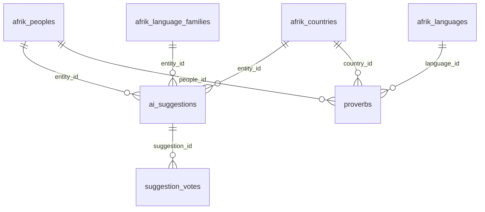
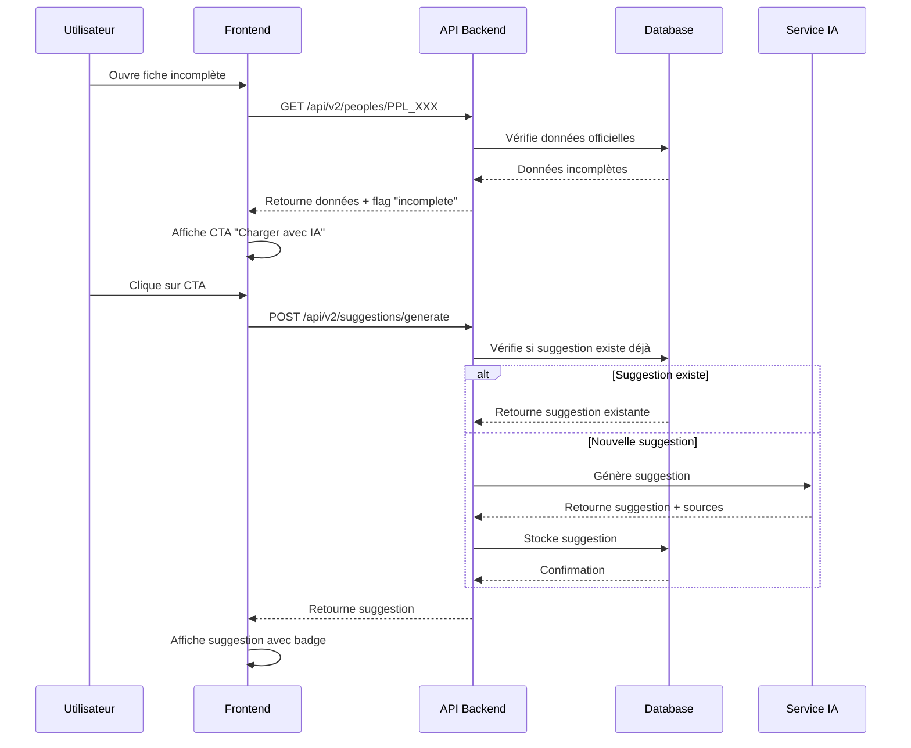
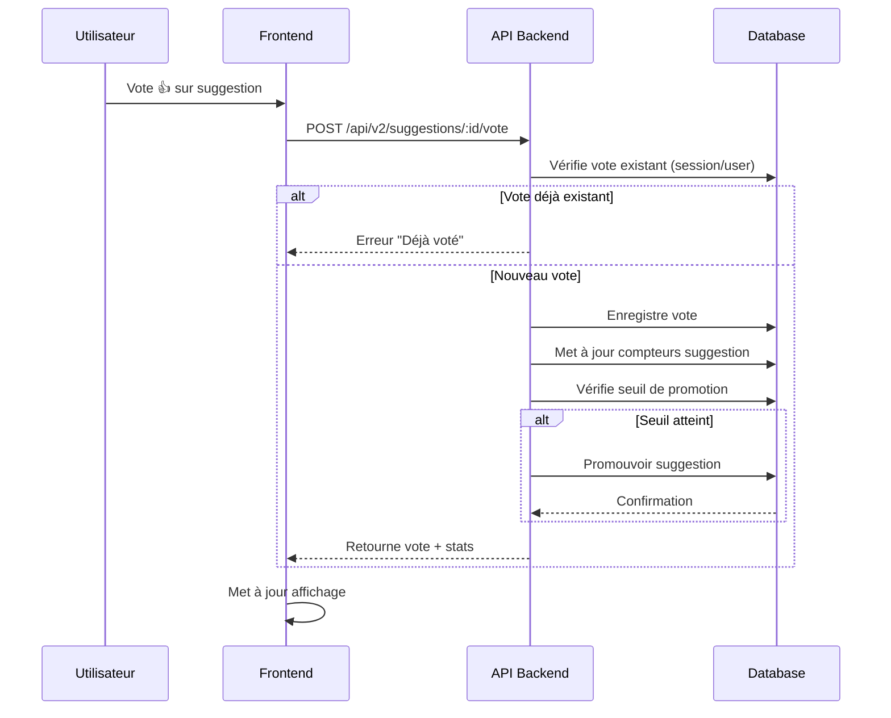

# V2 - Architecture technique

**Version** : 2.0  
**Date** : 2025-01-26  
**Statut** : Documentation

---

## 📊 Vue d'ensemble de l'architecture

La V2 ajoute trois nouvelles tables principales au schéma AFRIK existant :

1. `ai_suggestions` - Stockage des suggestions générées par IA
2. `suggestion_votes` - Votes des utilisateurs sur les suggestions
3. `proverbs` - Base de données de proverbes africains

Ces tables s'intègrent avec l'architecture AFRIK existante sans modifier les tables officielles.

---

## 🗄️ Schéma de base de données

### Table : `ai_suggestions`

Stocke toutes les suggestions générées par l'IA pour enrichir les fiches.

```sql
CREATE TABLE ai_suggestions (
  id UUID PRIMARY KEY DEFAULT gen_random_uuid(),

  -- Référence à l'entité cible (peuple, pays, famille linguistique)
  entity_type VARCHAR(50) NOT NULL, -- 'people', 'country', 'language_family'
  entity_id VARCHAR(50) NOT NULL,    -- PPL_xxxxx, ISO code, FLG_xxxxx

  -- Section de la fiche concernée
  section_name VARCHAR(100) NOT NULL, -- 'appellations', 'origines', 'migrations', etc.

  -- Contenu suggéré
  suggested_content JSONB NOT NULL, -- Structure flexible selon la section

  -- Métadonnées de génération
  generated_at TIMESTAMPTZ DEFAULT NOW(),
  generated_by VARCHAR(50) DEFAULT 'ai', -- 'ai', 'user', 'admin'
  ai_model VARCHAR(50), -- 'gpt-4', 'claude', etc.
  ai_prompt TEXT, -- Prompt utilisé pour génération
  sources JSONB, -- Sources utilisées par l'IA [{url, title, date}]

  -- Statut et validation
  status VARCHAR(20) DEFAULT 'pending', -- 'pending', 'approved', 'rejected', 'promoted'
  vote_score INTEGER DEFAULT 0, -- Score calculé (upvotes - downvotes)
  upvotes_count INTEGER DEFAULT 0,
  downvotes_count INTEGER DEFAULT 0,

  -- Promotion vers données officielles
  promoted_at TIMESTAMPTZ,
  promoted_by UUID, -- Admin qui a promu (si promotion manuelle)

  -- Métadonnées
  created_at TIMESTAMPTZ DEFAULT NOW(),
  updated_at TIMESTAMPTZ DEFAULT NOW()
);

-- Indexes
CREATE INDEX idx_ai_suggestions_entity ON ai_suggestions(entity_type, entity_id);
CREATE INDEX idx_ai_suggestions_status ON ai_suggestions(status);
CREATE INDEX idx_ai_suggestions_vote_score ON ai_suggestions(vote_score DESC);
CREATE INDEX idx_ai_suggestions_section ON ai_suggestions(entity_type, entity_id, section_name);
```

### Table : `suggestion_votes`

Enregistre tous les votes des utilisateurs sur les suggestions.

```sql
CREATE TABLE suggestion_votes (
  id UUID PRIMARY KEY DEFAULT gen_random_uuid(),
  suggestion_id UUID NOT NULL REFERENCES ai_suggestions(id) ON DELETE CASCADE,

  -- Utilisateur (peut être anonyme via session/fingerprint)
  user_id UUID, -- Si utilisateur authentifié
  session_id VARCHAR(255), -- Session anonyme
  fingerprint VARCHAR(255), -- Fingerprint navigateur (optionnel)

  -- Vote
  vote_type VARCHAR(10) NOT NULL, -- 'upvote', 'downvote'

  -- Métadonnées
  created_at TIMESTAMPTZ DEFAULT NOW(),
  ip_address INET, -- Pour détection de spam (optionnel)

  -- Contrainte : un utilisateur/session ne peut voter qu'une fois par suggestion
  UNIQUE(suggestion_id, user_id, session_id)
);

-- Indexes
CREATE INDEX idx_suggestion_votes_suggestion ON suggestion_votes(suggestion_id);
CREATE INDEX idx_suggestion_votes_user ON suggestion_votes(user_id);
CREATE INDEX idx_suggestion_votes_session ON suggestion_votes(session_id);
```

### Table : `proverbs`

Base de données de proverbes africains organisés par peuple/langue.

```sql
CREATE TABLE proverbs (
  id UUID PRIMARY KEY DEFAULT gen_random_uuid(),

  -- Proverbe
  text TEXT NOT NULL, -- Texte du proverbe
  translation_fr TEXT, -- Traduction française
  translation_en TEXT, -- Traduction anglaise
  meaning TEXT, -- Signification/explication

  -- Association
  people_id VARCHAR(50) REFERENCES afrik_peoples(id), -- PPL_xxxxx
  language_id VARCHAR(10) REFERENCES afrik_languages(id), -- ISO 639-3
  country_id CHAR(3) REFERENCES afrik_countries(id), -- ISO 3166-1 alpha-3

  -- Métadonnées
  source TEXT, -- Source du proverbe
  region VARCHAR(100), -- Région géographique
  created_at TIMESTAMPTZ DEFAULT NOW(),
  updated_at TIMESTAMPTZ DEFAULT NOW()
);

-- Indexes
CREATE INDEX idx_proverbs_people ON proverbs(people_id);
CREATE INDEX idx_proverbs_language ON proverbs(language_id);
CREATE INDEX idx_proverbs_country ON proverbs(country_id);
```

### Relations avec les tables AFRIK existantes



---

## 🔌 API Endpoints

### 1. Suggestions IA

#### `GET /api/v2/suggestions/:entityType/:entityId`

Récupère les suggestions pour une entité donnée.

**Paramètres** :

- `entityType` : `people`, `country`, `language_family`
- `entityId` : Identifiant de l'entité (PPL_xxxxx, ISO code, FLG_xxxxx)

**Réponse** :

```json
{
  "entityType": "people",
  "entityId": "PPL_YORUBA",
  "suggestions": [
    {
      "id": "uuid",
      "sectionName": "appellations",
      "suggestedContent": {...},
      "voteScore": 5,
      "upvotesCount": 7,
      "downvotesCount": 2,
      "status": "pending",
      "sources": [...],
      "generatedAt": "2025-01-26T10:00:00Z"
    }
  ]
}
```

#### `POST /api/v2/suggestions/generate`

Génère une suggestion IA à la volée.

**Body** :

```json
{
  "entityType": "people",
  "entityId": "PPL_YORUBA",
  "sectionName": "appellations",
  "missingFields": ["selfAppellation", "historicalExonyms"]
}
```

**Réponse** :

```json
{
  "suggestion": {
    "id": "uuid",
    "sectionName": "appellations",
    "suggestedContent": {...},
    "sources": [...],
    "generatedAt": "2025-01-26T10:00:00Z"
  }
}
```

### 2. Votes

#### `POST /api/v2/suggestions/:suggestionId/vote`

Enregistre un vote sur une suggestion.

**Body** :

```json
{
  "voteType": "upvote" // ou "downvote"
}
```

**Réponse** :

```json
{
  "success": true,
  "vote": {
    "id": "uuid",
    "voteType": "upvote",
    "createdAt": "2025-01-26T10:00:00Z"
  },
  "suggestion": {
    "id": "uuid",
    "voteScore": 6,
    "upvotesCount": 8,
    "downvotesCount": 2
  }
}
```

#### `GET /api/v2/suggestions/:suggestionId/votes`

Récupère les votes d'une suggestion (pour affichage).

### 3. Proverbes

#### `GET /api/v2/proverbs/random`

Récupère un proverbe aléatoire.

**Query params** :

- `peopleId` (optionnel) : Filtrer par peuple
- `languageId` (optionnel) : Filtrer par langue
- `countryId` (optionnel) : Filtrer par pays

**Réponse** :

```json
{
  "proverb": {
    "id": "uuid",
    "text": "Proverbe en langue originale",
    "translationFr": "Traduction française",
    "meaning": "Signification",
    "peopleId": "PPL_YORUBA",
    "source": "Source"
  }
}
```

---

## 🔄 Flux de données

### Génération de suggestion à la volée



### Système de vote



---

## 🔗 Intégration avec AFRIK v2

### Tables AFRIK existantes (non modifiées)

- `afrik_peoples` - Peuples (PPL_xxxxx)
- `afrik_countries` - Pays (ISO 3166-1 alpha-3)
- `afrik_language_families` - Familles linguistiques (FLG_xxxxx)
- `afrik_languages` - Langues (ISO 639-3)

### Principe de séparation

- **Données officielles** : Restent dans les tables AFRIK
- **Suggestions** : Stockées dans `ai_suggestions`
- **Promotion** : Copie de `ai_suggestions` vers tables AFRIK (via migration manuelle ou automatique)

### Service de promotion

```typescript
// Pseudo-code
async function promoteSuggestion(suggestionId: string) {
  const suggestion = await getSuggestion(suggestionId);

  // Mettre à jour la table AFRIK correspondante
  if (suggestion.entityType === "people") {
    await updateAfrikPeople(suggestion.entityId, {
      content: mergeContent(suggestion.suggestedContent),
    });
  }

  // Marquer la suggestion comme promue
  await updateSuggestion(suggestionId, {
    status: "promoted",
    promotedAt: new Date(),
  });
}
```

---

## 🛡️ Sécurité et validation

### Validation des votes

- Un utilisateur/session ne peut voter qu'une fois par suggestion
- Détection de spam via IP (optionnel)
- Rate limiting sur les endpoints de génération IA

### Validation des suggestions

- Vérification de l'existence de l'entité cible
- Validation du format JSONB `suggestedContent`
- Vérification des sources IA

### Permissions

- **Lecture** : Publique (tous peuvent voir suggestions et votes)
- **Vote** : Publique (session anonyme acceptée)
- **Génération IA** : Publique (mais rate-limited)
- **Promotion** : Admin uniquement (ou automatique si seuil atteint)

---

## 📈 Performance

### Optimisations

- **Cache** : Mise en cache des suggestions fréquemment consultées
- **Indexes** : Indexes sur `entity_type`, `entity_id`, `status`, `vote_score`
- **Lazy loading** : Chargement des suggestions uniquement si nécessaire
- **Pagination** : Pagination des votes si nécessaire

### Monitoring

- Temps de génération IA
- Taux de votes positifs/négatifs
- Taux de promotion
- Utilisation des proverbes

---

## 🔄 Migrations

### Migration 007 : Tables V2

```sql
-- Voir schéma complet ci-dessus
-- Migration à créer dans supabase/migrations/007_v2_suggestions.sql
```

---

## 📚 Références

- [Schéma AFRIK existant](../supabase/migrations/006_afrik_schema.sql)
- [API AFRIK v2](../API_AFRIK_REFERENCE.md)
- [Système de contributions existant](../src/app/api/contributions/route.ts)

---

**Prochaine étape** : Consulter [V2_AI_SUGGESTIONS.md](./V2_AI_SUGGESTIONS.md) pour les détails sur la génération IA.
