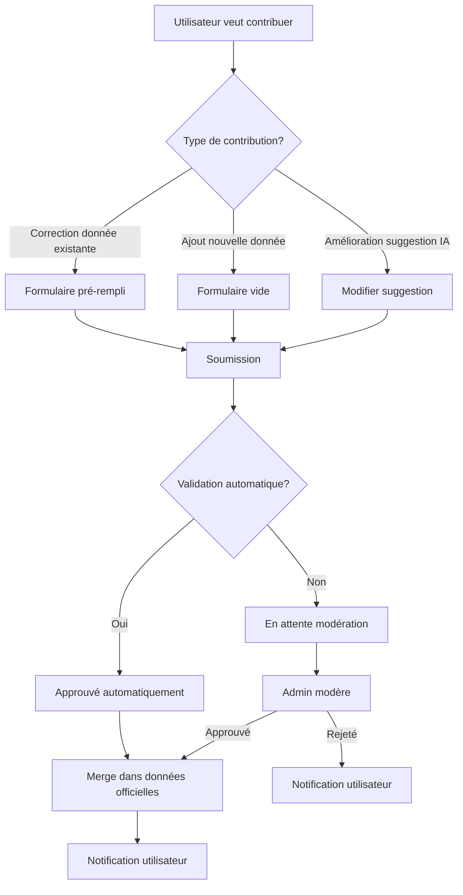

# V2 - Amélioration du système de contributions

**Version** : 2.0  
**Date** : 2025-01-26  
**Statut** : Documentation

---

## 🎯 Objectif

Améliorer le système de contributions existant pour l'intégrer avec les suggestions IA et offrir une expérience utilisateur plus fluide et intuitive.

---

## 🔄 Nouveau workflow de contribution

### Workflow actuel (V1)

1. Utilisateur remplit un formulaire
2. Soumission via `/api/contributions`
3. Modération admin
4. Approbation/rejet
5. Merge dans tables officielles

### Workflow amélioré (V2)



---

## 🎨 Interface utilisateur améliorée

### 1. Bouton de contribution contextuel

Sur chaque fiche, ajouter un bouton "Suggérer une amélioration" :

```tsx
function ContributionButton({ entityType, entityId }: Props) {
  return (
    <DropdownMenu>
      <DropdownMenuTrigger asChild>
        <Button variant="outline" size="sm">
          <Edit className="h-4 w-4 mr-2" />
          Suggérer une amélioration
        </Button>
      </DropdownMenuTrigger>
      <DropdownMenuContent>
        <DropdownMenuItem onClick={() => openContributionForm("correction")}>
          Corriger une information
        </DropdownMenuItem>
        <DropdownMenuItem onClick={() => openContributionForm("addition")}>
          Ajouter une information
        </DropdownMenuItem>
        <DropdownMenuItem onClick={() => openContributionForm("source")}>
          Ajouter une source
        </DropdownMenuItem>
      </DropdownMenuContent>
    </DropdownMenu>
  );
}
```

### 2. Formulaire pré-rempli pour corrections

Lorsqu'un utilisateur veut corriger une donnée existante :

```tsx
function CorrectionForm({
  entityType,
  entityId,
  fieldName,
  currentValue,
}: Props) {
  const [newValue, setNewValue] = useState(currentValue);
  const [source, setSource] = useState("");
  const [notes, setNotes] = useState("");

  return (
    <Dialog>
      <DialogContent>
        <DialogHeader>
          <DialogTitle>Corriger : {fieldName}</DialogTitle>
        </DialogHeader>

        <div className="space-y-4">
          {/* Valeur actuelle */}
          <div>
            <Label>Valeur actuelle</Label>
            <div className="p-2 bg-muted rounded">
              {currentValue || "Non renseigné"}
            </div>
          </div>

          {/* Nouvelle valeur */}
          <div>
            <Label>Nouvelle valeur</Label>
            <Input
              value={newValue}
              onChange={(e) => setNewValue(e.target.value)}
            />
          </div>

          {/* Source */}
          <div>
            <Label>Source de votre information</Label>
            <Input
              value={source}
              onChange={(e) => setSource(e.target.value)}
              placeholder="URL, livre, article..."
            />
          </div>

          {/* Notes */}
          <div>
            <Label>Notes (optionnel)</Label>
            <Textarea
              value={notes}
              onChange={(e) => setNotes(e.target.value)}
              placeholder="Pourquoi cette correction est importante..."
            />
          </div>
        </div>

        <DialogFooter>
          <Button onClick={handleSubmit}>Soumettre la correction</Button>
        </DialogFooter>
      </DialogContent>
    </Dialog>
  );
}
```

### 3. Intégration avec suggestions IA

Permettre aux utilisateurs de modifier directement une suggestion IA :

```tsx
function EditSuggestionForm({ suggestion }: { suggestion: Suggestion }) {
  const [editedContent, setEditedContent] = useState(
    suggestion.suggestedContent
  );

  return (
    <Card>
      <CardHeader>
        <CardTitle className="flex items-center gap-2">
          <Sparkles className="h-5 w-5" />
          Modifier la suggestion IA
        </CardTitle>
      </CardHeader>
      <CardContent>
        <Form>
          {/* Formulaire basé sur la section */}
          <SectionForm
            sectionName={suggestion.sectionName}
            content={editedContent}
            onChange={setEditedContent}
          />

          <div className="mt-4 flex gap-2">
            <Button onClick={handleSaveAsContribution}>
              Enregistrer comme contribution
            </Button>
            <Button variant="outline" onClick={handleVoteAndEdit}>
              Voter et modifier
            </Button>
          </div>
        </Form>
      </CardContent>
    </Card>
  );
}
```

---

## 🔗 Intégration avec suggestions IA

### Workflow : Suggestion → Contribution

Un utilisateur peut transformer une suggestion IA en contribution améliorée :

```typescript
async function convertSuggestionToContribution(
  suggestionId: string,
  editedContent: any,
  userId: string
) {
  const suggestion = await getSuggestion(suggestionId);

  // Créer contribution basée sur suggestion
  const contribution = await createContribution({
    type: `update_${suggestion.entityType}`,
    proposed_payload: {
      ...suggestion.suggestedContent,
      ...editedContent, // Modifications utilisateur
    },
    notes: `Basé sur suggestion IA ${suggestionId}, modifié par utilisateur`,
    contributor_name: userId,
    metadata: {
      sourceSuggestionId: suggestionId,
      isAISuggestionEdit: true,
    },
  });

  return contribution;
}
```

### Affichage des suggestions dans le formulaire

Dans le formulaire de contribution, afficher les suggestions IA pertinentes :

```tsx
function ContributionFormWithSuggestions({ entityType, entityId }: Props) {
  const suggestions = useSuggestions(entityType, entityId);

  return (
    <div className="space-y-4">
      {/* Formulaire principal */}
      <ContributionForm entityType={entityType} entityId={entityId} />

      {/* Suggestions IA disponibles */}
      {suggestions.length > 0 && (
        <Card>
          <CardHeader>
            <CardTitle>Suggestions IA disponibles</CardTitle>
          </CardHeader>
          <CardContent>
            {suggestions.map((suggestion) => (
              <SuggestionCard
                key={suggestion.id}
                suggestion={suggestion}
                onUse={() => prefillForm(suggestion)}
                onEdit={() => openEditForm(suggestion)}
              />
            ))}
          </CardContent>
        </Card>
      )}
    </div>
  );
}
```

---

## 📝 Types de contributions améliorés

### Nouveaux types

Ajouter de nouveaux types de contributions :

```typescript
type ContributionType =
  // Types existants
  | "new_region"
  | "new_country"
  | "new_ethnicity"
  | "update_region"
  | "update_country"
  | "update_ethnicity"
  | "new_presence"
  | "update_presence"
  // Nouveaux types V2
  | "update_people" // Mise à jour peuple AFRIK
  | "update_language_family" // Mise à jour famille linguistique
  | "add_source" // Ajout de source
  | "correct_translation" // Correction traduction
  | "improve_suggestion"; // Amélioration suggestion IA
```

### Validation améliorée

```typescript
const contributionSchemaV2 = z.object({
  type: contributionTypeSchema,
  proposed_payload: z.record(z.unknown()),

  // Nouveaux champs
  source_suggestion_id: z.string().uuid().optional(), // Si basé sur suggestion
  field_name: z.string().optional(), // Champ spécifique modifié
  current_value: z.unknown().optional(), // Valeur actuelle (pour comparaison)
  new_value: z.unknown().optional(), // Nouvelle valeur

  // Champs existants
  contributor_email: z.string().email().optional(),
  contributor_name: z.string().optional(),
  notes: z.string().max(2000).optional(),
  honeypot: z.string().optional(),
});
```

---

## 🎯 Modération admin améliorée

### Interface de modération enrichie

```tsx
function AdminContributionReview({ contributionId }: Props) {
  const contribution = useContribution(contributionId);
  const suggestion = contribution.metadata?.sourceSuggestionId
    ? useSuggestion(contribution.metadata.sourceSuggestionId)
    : null;

  return (
    <div className="space-y-4">
      {/* Informations contribution */}
      <ContributionDetails contribution={contribution} />

      {/* Suggestion source (si applicable) */}
      {suggestion && (
        <Card>
          <CardHeader>
            <CardTitle>Suggestion IA source</CardTitle>
          </CardHeader>
          <CardContent>
            <SuggestionPreview suggestion={suggestion} />
          </CardContent>
        </Card>
      )}

      {/* Comparaison avant/après */}
      <ComparisonView
        current={contribution.current_value}
        proposed={contribution.proposed_payload}
      />

      {/* Actions */}
      <div className="flex gap-2">
        <Button onClick={() => approveContribution(contributionId)}>
          Approuver
        </Button>
        <Button
          variant="destructive"
          onClick={() => rejectContribution(contributionId)}
        >
          Rejeter
        </Button>
        <Button
          variant="outline"
          onClick={() => requestChanges(contributionId)}
        >
          Demander des modifications
        </Button>
      </div>
    </div>
  );
}
```

### Comparaison avant/après

```tsx
function ComparisonView({ current, proposed }: Props) {
  return (
    <div className="grid grid-cols-2 gap-4">
      <Card>
        <CardHeader>
          <CardTitle>Valeur actuelle</CardTitle>
        </CardHeader>
        <CardContent>
          <pre className="text-sm">{JSON.stringify(current, null, 2)}</pre>
        </CardContent>
      </Card>

      <Card>
        <CardHeader>
          <CardTitle>Valeur proposée</CardTitle>
        </CardHeader>
        <CardContent>
          <pre className="text-sm">{JSON.stringify(proposed, null, 2)}</pre>
        </CardContent>
      </Card>
    </div>
  );
}
```

---

## 🔔 Notifications utilisateur

### Notifications améliorées

```typescript
interface ContributionNotification {
  type:
    | "contribution_submitted"
    | "contribution_approved"
    | "contribution_rejected";
  contributionId: string;
  message: string;
  actionUrl?: string;
}

async function sendContributionNotification(
  userId: string,
  notification: ContributionNotification
) {
  // Notification in-app
  await createInAppNotification(userId, notification);

  // Notification email (si email fourni)
  const user = await getUser(userId);
  if (user.email) {
    await sendEmail(user.email, {
      subject: getNotificationSubject(notification.type),
      body: renderNotificationEmail(notification),
    });
  }
}
```

### Messages de notification

```typescript
function getNotificationMessage(
  type: string,
  contribution: Contribution
): string {
  switch (type) {
    case "contribution_submitted":
      return `Votre contribution pour "${contribution.entityId}" a été soumise avec succès. Elle sera examinée par notre équipe.`;

    case "contribution_approved":
      return `🎉 Votre contribution pour "${contribution.entityId}" a été approuvée et intégrée dans la base de données !`;

    case "contribution_rejected":
      return `Votre contribution pour "${contribution.entityId}" a été rejetée. ${contribution.moderator_notes || ""}`;

    default:
      return "Mise à jour sur votre contribution";
  }
}
```

---

## 📊 Statistiques de contributions

### Dashboard contributeur

```tsx
function ContributorDashboard({ userId }: Props) {
  const contributions = useUserContributions(userId);

  return (
    <div className="space-y-4">
      <StatsCards
        total={contributions.length}
        approved={contributions.filter((c) => c.status === "approved").length}
        pending={contributions.filter((c) => c.status === "pending").length}
        rejected={contributions.filter((c) => c.status === "rejected").length}
      />

      <ContributionsList contributions={contributions} />
    </div>
  );
}
```

### Badges de contributeur

Récompenser les contributeurs actifs :

```typescript
function calculateContributorBadge(contributions: Contribution[]): string {
  const approvedCount = contributions.filter(
    (c) => c.status === "approved"
  ).length;

  if (approvedCount >= 50) return "Expert";
  if (approvedCount >= 20) return "Contributeur confirmé";
  if (approvedCount >= 5) return "Contributeur actif";
  if (approvedCount >= 1) return "Contributeur";

  return "Nouveau contributeur";
}
```

---

## 🔄 Workflow de fusion amélioré

### Fusion intelligente avec suggestions

Lors de l'approbation d'une contribution basée sur une suggestion :

```typescript
async function mergeContributionWithSuggestion(
  contributionId: string,
  suggestionId: string
) {
  const contribution = await getContribution(contributionId);
  const suggestion = await getSuggestion(suggestionId);

  // Fusionner les contenus
  const mergedContent = {
    ...suggestion.suggestedContent,
    ...contribution.proposed_payload, // Priorité à la contribution utilisateur
  };

  // Mettre à jour les données officielles
  await updateOfficialData(
    contribution.type,
    contribution.entityId,
    mergedContent
  );

  // Marquer suggestion comme promue (via contribution)
  await updateSuggestion(suggestionId, {
    status: "promoted",
    promotedAt: new Date(),
    promotedBy: contribution.contributor_id,
  });

  // Marquer contribution comme approuvée
  await updateContribution(contributionId, {
    status: "approved",
    reviewed_at: new Date(),
  });
}
```

---

## 📚 Références

- [Système de contributions existant](../src/app/api/contributions/route.ts)
- [Validation contributions](../src/lib/validations/contribution.ts)
- [Interface admin](../src/app/admin/contributions/page.tsx)
- [Système de vote](./V2_VOTING_SYSTEM.md)

---

**Prochaine étape** : Consulter [V2_PROVERBS.md](./V2_PROVERBS.md) pour le système de proverbes africains.
