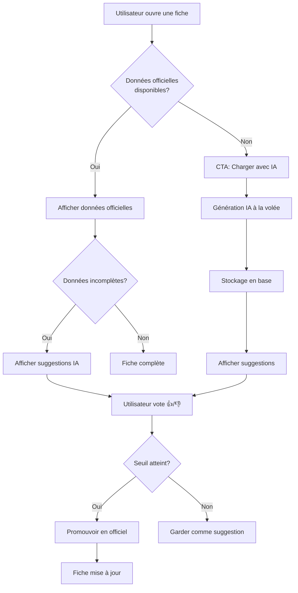

# V2 - Vue d'ensemble du système

**Version** : 2.0  
**Date** : 2025-01-26  
**Statut** : Documentation

---

## 🌍 L'idée du site (version simple)

Le site Afrik contient des fiches sur des pays, des peuples, des langues…  
Mais aujourd'hui, _beaucoup de fiches sont incomplètes_, parce que personne ne peut tout remplir à la main.

👉 **L'idée est que _le site se complète petit à petit tout seul_, au fur et à mesure que les gens l'utilisent.**

---

## 📄 Comment fonctionne une fiche (ex : un peuple)

### 1. Quand un utilisateur ouvre une fiche :

- On affiche _ce qu'on sait déjà avec certitude_ (contenu validé)
- S'il manque des infos, le site propose _des informations suggérées_

### 2. Ces suggestions :

- Viennent d'une IA qui cherche dans _des sources sérieuses_
- Sont clairement marquées comme _"suggestions"_, pas comme des faits sûrs
- Sont générées **à la volée** lors de la première requête
- Sont stockées en base pour être partagées avec tous les utilisateurs

### 3. L'utilisateur peut dire :

- 👍 "Cette info est utile"
- 👎 "Cette info n'est pas fiable"

---

## 🧠 Pourquoi c'est intelligent

- Le site _donne toujours quelque chose à lire_, même si la fiche est vide au départ
- Les utilisateurs _aident à améliorer la qualité_ sans écrire eux-mêmes
- Plus une info est validée par les gens, plus elle devient _fiable_
- Le chargement à la volée évite de générer des données inutiles
- La première requête enrichit la base pour tous les utilisateurs suivants

---

## 🗄️ Ce qui est important côté données (sans technique)

Il y a _2 niveaux d'information_ :

### 1. Infos officielles

- Sûres
- Validées
- Stables
- Visibles par défaut
- Stockées dans les tables AFRIK (`afrik_peoples`, `afrik_countries`, etc.)

### 2. Infos suggérées

- Proposées par l'IA
- Visibles mais clairement signalées
- Stockées séparément dans `ai_suggestions`
- Peuvent devenir officielles plus tard via le système de vote
- Générées à la volée lors de la première requête

👉 **Une suggestion ne remplace jamais une info officielle automatiquement.**

---

## 🔄 Flux utilisateur global

---

## 🔒 Sécurité et qualité

- **Rien n'est effacé** : Les données officielles ne sont jamais supprimées
- **Chaque amélioration crée une nouvelle version** : Historique complet
- **On sait toujours** :
  - D'où vient l'info (IA, utilisateur, source)
  - Quand elle a été ajoutée
  - Si elle a été validée ou non
  - Qui a voté et comment

### Traçabilité complète

- Chaque suggestion a un identifiant unique
- Chaque vote est enregistré avec timestamp et contexte
- Les sources IA sont documentées
- L'historique des promotions est conservé

---

## 🎯 Résultat final

- Le site _s'améliore tout seul avec le temps_
- Les utilisateurs découvrent et apprennent
- La base de données devient de plus en plus riche _sans perdre la qualité_
- Afrik devient une _encyclopédie vivante_, pas figée
- Les proverbes africains rendent l'attente agréable pendant le chargement

---

## 🧩 En une phrase

_Les utilisateurs viennent chercher de l'information, et sans s'en rendre compte, ils aident le site à devenir plus complet et plus fiable._

---

## 📚 Architecture à deux niveaux

### Niveau 1 : Données officielles (AFRIK)

- **Tables** : `afrik_peoples`, `afrik_countries`, `afrik_language_families`
- **Source** : Données validées, migrées depuis les fichiers AFRIK
- **Statut** : Stable, vérifié
- **Affichage** : Par défaut, sans badge spécial

### Niveau 2 : Suggestions IA

- **Table** : `ai_suggestions`
- **Source** : Génération IA à la volée
- **Statut** : En attente de validation
- **Affichage** : Badge "Suggestion IA", boutons de vote

### Passage de niveau 2 → niveau 1

- Via système de vote (seuil à définir)
- Validation admin possible
- Promotion automatique si seuil atteint

---

## 🎨 Expérience utilisateur

### Pendant le chargement

- Affichage de **proverbes africains** pour faire patienter
- Proverbes liés au peuple/pays consulté si possible
- Rotation aléatoire si plusieurs proverbes disponibles

### Affichage des suggestions

- Badge clair "💡 Suggestion IA"
- Boutons de vote visibles et accessibles
- Indication du nombre de votes déjà reçus
- Sources citées si disponibles

### Feedback utilisateur

- Message de confirmation après vote
- Indication si le seuil de validation est proche
- Notification si une suggestion devient officielle

---

## 🔗 Liens vers la documentation détaillée

- [Architecture technique](./V2_ARCHITECTURE.md) - Schéma de base de données, API endpoints
- [Système de suggestions IA](./V2_AI_SUGGESTIONS.md) - Génération, sources, affichage
- [Système de vote](./V2_VOTING_SYSTEM.md) - Mécanisme de vote, seuils, promotion
- [Amélioration des contributions](./V2_CONTRIBUTIONS.md) - Nouveau workflow, intégration
- [Proverbes africains](./V2_PROVERBS.md) - Base de données, affichage, API
- [Guide d'implémentation](./V2_IMPLEMENTATION_GUIDE.md) - Étapes détaillées, code, tests

---

## 📝 Notes importantes

- Cette V2 s'appuie sur l'architecture AFRIK existante (API v2)
- Compatible avec le système de contributions actuel
- Respecte les principes décoloniaux du projet
- Utilise uniquement des sources autorisées pour l'IA
- Aucune donnée n'est inventée, tout est sourcé

---

**Prochaine étape** : Consulter [V2_ARCHITECTURE.md](./V2_ARCHITECTURE.md) pour les détails techniques.
