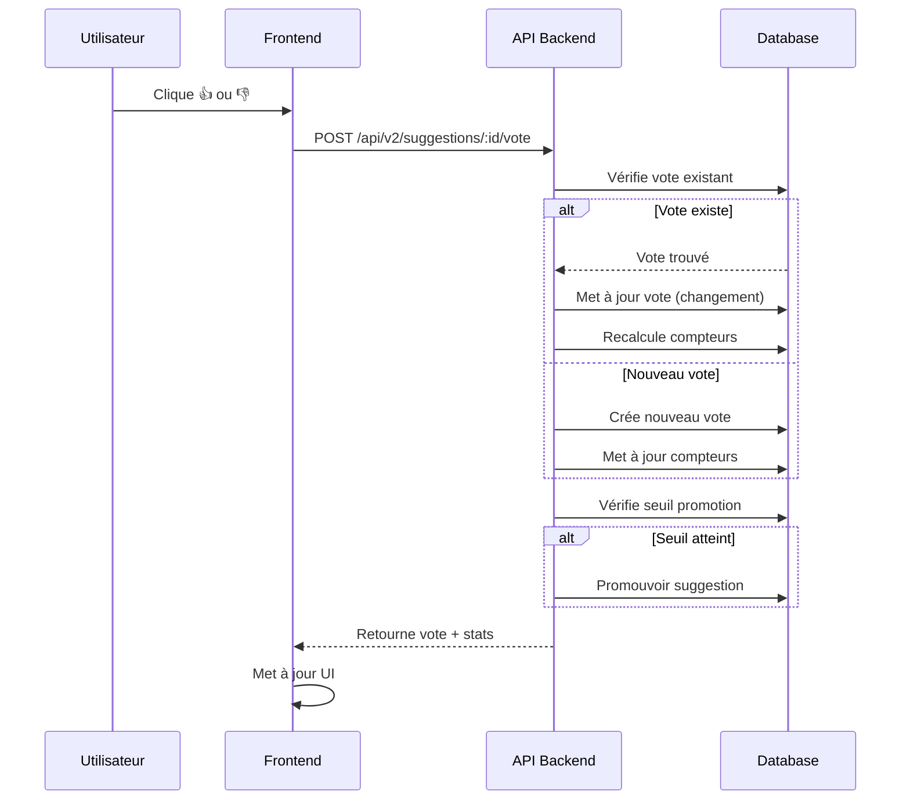
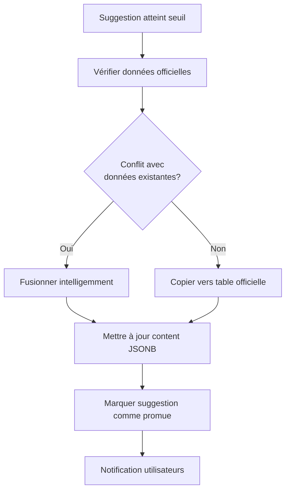

# V2 - Système de vote et validation

**Version** : 2.0  
**Date** : 2025-01-26  
**Statut** : Documentation

---

## 🎯 Objectif

Le système de vote permet aux utilisateurs de valider ou rejeter les suggestions IA, créant un mécanisme de validation collective qui améliore progressivement la qualité des données.

---

## 👍👎 Mécanisme de vote

### Types de votes

- **Upvote (👍)** : L'utilisateur trouve l'information utile et fiable
- **Downvote (👎)** : L'utilisateur trouve l'information incorrecte ou non fiable

### Règles de vote

1. **Un vote par suggestion** : Un utilisateur/session ne peut voter qu'une fois par suggestion
2. **Vote modifiable** : Un utilisateur peut changer son vote (upvote → downvote ou inversement)
3. **Vote anonyme autorisé** : Pas besoin d'être authentifié (via session/fingerprint)
4. **Vote authentifié prioritaire** : Si utilisateur authentifié, utiliser `user_id` plutôt que `session_id`

---

## 📊 Calcul du score

### Score de vote

```typescript
voteScore = upvotesCount - downvotesCount;
```

**Exemple** :

- 10 upvotes, 2 downvotes → Score = 8
- 5 upvotes, 7 downvotes → Score = -2

### Affichage du score

Le score est affiché à côté de la suggestion :

```tsx
<div className="flex items-center gap-2">
  <Button
    variant={userVote === "upvote" ? "default" : "outline"}
    onClick={() => handleVote("upvote")}
  >
    👍 {suggestion.upvotesCount}
  </Button>
  <Button
    variant={userVote === "downvote" ? "default" : "outline"}
    onClick={() => handleVote("downvote")}
  >
    👎 {suggestion.downvotesCount}
  </Button>
  <span className="text-sm text-muted-foreground">
    Score: {suggestion.voteScore}
  </span>
</div>
```

---

## 🎯 Seuils de validation

### Seuil de promotion automatique

Une suggestion peut être **automatiquement promue** en donnée officielle si :

1. **Score minimum** : `voteScore >= PROMOTION_THRESHOLD` (ex: 10)
2. **Ratio positif** : `upvotesCount / (upvotesCount + downvotesCount) >= 0.7` (70% de votes positifs)
3. **Nombre minimum de votes** : `(upvotesCount + downvotesCount) >= MIN_VOTES` (ex: 5)

**Exemple de configuration** :

```typescript
const PROMOTION_THRESHOLD = 10;
const MIN_POSITIVE_RATIO = 0.7;
const MIN_VOTES = 5;

function shouldPromote(suggestion: Suggestion): boolean {
  const totalVotes = suggestion.upvotesCount + suggestion.downvotesCount;
  const positiveRatio = suggestion.upvotesCount / totalVotes;

  return (
    suggestion.voteScore >= PROMOTION_THRESHOLD &&
    positiveRatio >= MIN_POSITIVE_RATIO &&
    totalVotes >= MIN_VOTES
  );
}
```

### Promotion manuelle (Admin)

Un admin peut promouvoir manuellement une suggestion même si les seuils ne sont pas atteints :

```typescript
async function promoteSuggestionManually(
  suggestionId: string,
  adminId: string
) {
  await updateSuggestion(suggestionId, {
    status: "promoted",
    promotedAt: new Date(),
    promotedBy: adminId,
  });

  // Copier vers table officielle
  await copyToOfficialData(suggestionId);
}
```

---

## 🔄 Processus de vote

### 1. Enregistrement du vote



### 2. Mise à jour des compteurs

```typescript
async function updateVoteCounters(suggestionId: string) {
  const votes = await getVotesForSuggestion(suggestionId);

  const upvotesCount = votes.filter((v) => v.voteType === "upvote").length;
  const downvotesCount = votes.filter((v) => v.voteType === "downvote").length;
  const voteScore = upvotesCount - downvotesCount;

  await updateSuggestion(suggestionId, {
    upvotesCount,
    downvotesCount,
    voteScore,
  });

  // Vérifier promotion
  const suggestion = await getSuggestion(suggestionId);
  if (shouldPromote(suggestion)) {
    await promoteSuggestion(suggestionId);
  }
}
```

### 3. Gestion du changement de vote

```typescript
async function handleVote(
  suggestionId: string,
  userId: string | null,
  sessionId: string,
  voteType: "upvote" | "downvote"
) {
  // Chercher vote existant
  const existingVote = await findExistingVote(suggestionId, userId, sessionId);

  if (existingVote) {
    if (existingVote.voteType === voteType) {
      // Même vote : ne rien faire (ou permettre annulation)
      return { success: false, message: "Vous avez déjà voté ainsi" };
    } else {
      // Changement de vote : mettre à jour
      await updateVote(existingVote.id, { voteType });
    }
  } else {
    // Nouveau vote : créer
    await createVote({
      suggestionId,
      userId,
      sessionId,
      voteType,
    });
  }

  // Recalculer compteurs
  await updateVoteCounters(suggestionId);

  return { success: true };
}
```

---

## 📈 Promotion vers données officielles

### Processus de promotion



### Fusion intelligente

Lors de la promotion, si des données officielles existent déjà :

```typescript
async function mergeSuggestionIntoOfficial(
  suggestion: Suggestion,
  officialData: any
) {
  const sectionName = suggestion.sectionName;
  const suggestedContent = suggestion.suggestedContent;
  const existingContent = officialData.content[sectionName] || {};

  // Fusion : priorité aux données officielles existantes
  const mergedContent = {
    ...existingContent,
    ...suggestedContent, // Les suggestions complètent, ne remplacent pas
  };

  // Mettre à jour
  await updateOfficialData(suggestion.entityType, suggestion.entityId, {
    content: {
      ...officialData.content,
      [sectionName]: mergedContent,
    },
  });
}
```

### Notification

Après promotion, notifier les utilisateurs qui ont voté :

```typescript
async function notifyPromotion(suggestionId: string) {
  const votes = await getVotesForSuggestion(suggestionId);
  const users = votes.filter((v) => v.userId).map((v) => v.userId);

  // Envoyer notification (email, in-app, etc.)
  for (const userId of users) {
    await sendNotification(userId, {
      type: "suggestion_promoted",
      suggestionId,
      message:
        "Une suggestion que vous avez validée a été promue en donnée officielle",
    });
  }
}
```

---

## 📊 Historique des votes

### Affichage de l'historique

Pour chaque suggestion, on peut afficher :

- **Nombre total de votes** : `upvotesCount + downvotesCount`
- **Score actuel** : `voteScore`
- **Ratio positif** : `upvotesCount / totalVotes`
- **Dernier vote** : Timestamp du dernier vote
- **Tendance** : Évolution du score dans le temps

### Graphique d'évolution

```tsx
function VoteHistoryChart({ suggestionId }: { suggestionId: string }) {
  const history = useVoteHistory(suggestionId);

  return (
    <LineChart data={history}>
      <Line dataKey="voteScore" stroke="#8884d8" />
      <XAxis dataKey="date" />
      <YAxis />
    </LineChart>
  );
}
```

---

## 🛡️ Protection contre le spam

### Détection de votes suspects

1. **Rate limiting** : Max 10 votes par heure par IP
2. **Pattern detection** : Détecter les votes en masse sur une même suggestion
3. **Fingerprinting** : Utiliser fingerprint navigateur pour détecter multi-comptes
4. **Validation CAPTCHA** : Si comportement suspect détecté

### Filtrage des votes

```typescript
async function filterSuspiciousVotes(suggestionId: string) {
  const votes = await getVotesForSuggestion(suggestionId);

  // Détecter votes suspects
  const suspiciousVotes = votes.filter((vote) => {
    // Votes depuis même IP en masse
    const ipVotes = votes.filter((v) => v.ipAddress === vote.ipAddress);
    if (ipVotes.length > 5) return true;

    // Votes trop rapides
    const recentVotes = votes.filter(
      (v) => Math.abs(v.createdAt - vote.createdAt) < 1000 // < 1 seconde
    );
    if (recentVotes.length > 3) return true;

    return false;
  });

  // Exclure votes suspects du calcul
  return votes.filter((v) => !suspiciousVotes.includes(v));
}
```

---

## 📈 Métriques et analytics

### Métriques à suivre

- **Taux de vote** : % de suggestions avec au moins un vote
- **Ratio positif** : Moyenne des ratios upvote/total
- **Taux de promotion** : % de suggestions promues
- **Temps moyen jusqu'à promotion** : Temps entre création et promotion
- **Distribution des scores** : Histogramme des scores de vote

### Dashboard admin

```typescript
interface VotingMetrics {
  totalSuggestions: number;
  suggestionsWithVotes: number;
  averageVoteScore: number;
  promotionRate: number;
  averageTimeToPromotion: number;
  topRatedSuggestions: Suggestion[];
  controversialSuggestions: Suggestion[]; // Score proche de 0
}
```

---

## 🔗 Intégration avec contributions

Les suggestions promues peuvent être traitées comme des contributions validées :

```typescript
async function createContributionFromPromotedSuggestion(suggestionId: string) {
  const suggestion = await getSuggestion(suggestionId);

  // Créer une contribution "automatique" pour traçabilité
  await createContribution({
    type: `update_${suggestion.entityType}`,
    proposed_payload: suggestion.suggestedContent,
    status: "approved", // Déjà validé par votes
    notes: `Promu automatiquement depuis suggestion IA (score: ${suggestion.voteScore})`,
    contributor_name: "Système de vote communautaire",
  });
}
```

---

## 📚 Références

- [Architecture V2](./V2_ARCHITECTURE.md) - Schéma de base de données
- [Système de contributions](./V2_CONTRIBUTIONS.md) - Intégration avec contributions
- [API Endpoints](../src/app/api/v2/) - Endpoints de vote

---

**Prochaine étape** : Consulter [V2_CONTRIBUTIONS.md](./V2_CONTRIBUTIONS.md) pour l'amélioration du système de contributions.
